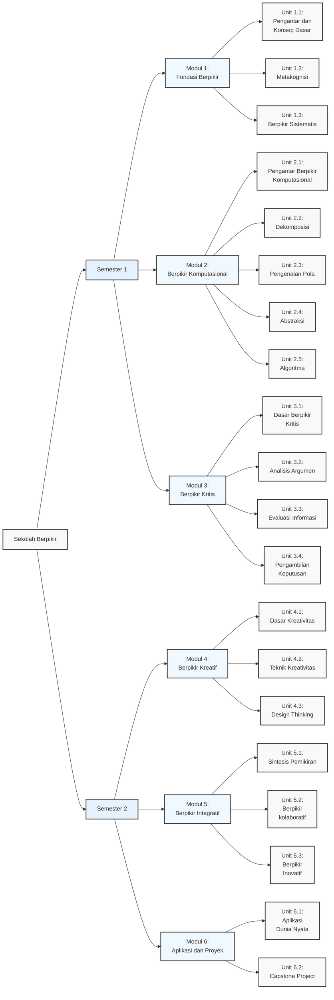

# SEKOLAH BERPIKIR

Kurikulum Program 1 Tahun (40 Minggu Efektif)

---

## MODUL 1: FONDASI BERPIKIR (5 Minggu)

### Unit 1.1: Pengantar dan Konsep Dasar (1 minggu)

#### 1.1.1 Pengertian dan Hakikat Berpikir

##### a. Definisi berpikir

Berpikir adalah proses kognitif yang melibatkan manipulasi mental terhadap informasi. Proses ini mencakup pembentukan konsep, pemecahan masalah, dan pengambilan keputusan. Kemampuan berpikir berkembang seiring pengalaman dan pembelajaran.

##### b. Tingkatan berpikir

Tingkatan berpikir terdiri dari beberapa tahap, mulai dari yang sederhana hingga kompleks. Tingkat dasar meliputi mengingat dan memahami, sedangkan tingkat tinggi melibatkan analisis, evaluasi, dan penciptaan. Penguasaan tingkat berpikir yang lebih tinggi menunjukkan kedalaman pemahaman.

##### c. Proses kognitif dasar

Proses kognitif dasar adalah fondasi dari semua aktivitas mental, termasuk persepsi, perhatian, dan memori. Proses ini memungkinkan individu untuk menerima, menyimpan, dan memanipulasi informasi. Kemampuan kognitif dasar sangat penting untuk pembelajaran dan pemecahan masalah.

##### d. Perkembangan kemampuan berpikir manusia

Kemampuan berpikir manusia berkembang secara bertahap sepanjang hidup. Perkembangan ini dipengaruhi oleh faktor biologis, lingkungan, dan pengalaman. Pendidikan dan latihan dapat meningkatkan kapasitas berpikir kritis dan kreatif.

#### 1.1.2 Pola Pikir dan Mindset

##### a. Pola pikir berkembang vs pola pikir tetap (Growth mindset vs Fixed mindset)

Pola pikir berkembang percaya bahwa kemampuan dapat dikembangkan melalui usaha dan belajar, sementara pola pikir tetap menganggap kemampuan bersifat bawaan dan tidak berubah. Memiliki pola pikir berkembang mendorong ketekunan dan ketahanan menghadapi tantangan. Perbedaan ini mempengaruhi pendekatan seseorang terhadap pembelajaran.

##### b. Mengembangkan pola pikir positif

Pola pikir positif dapat dikembangkan melalui kesadaran diri dan praktik reflektif. Fokus pada pembelajaran dan pertumbuhan pribadi membantu mengatasi pikiran negatif. Pola pikir positif juga meningkatkan kesejahteraan psikologis dan kemampuan menghadapi kesulitan.

##### c. Mengatasi hambatan mental

Hambatan mental seperti keyakinan negatif dan ketakutan gagal dapat diatasi melalui teknik reframing dan self-talk positif. Pengembangan kesadaran emosional dan ketahanan mental juga penting. Dukungan sosial dan lingkungan yang positif memfasilitasi proses ini.

##### d. Kesadaran diri (Self-awareness) dalam berpikir

Kesadaran diri adalah kemampuan untuk mengenali pikiran, emosi, dan motivasi diri sendiri. Kemampuan ini memungkinkan refleksi dan pengaturan diri dalam proses berpikir. Kesadaran diri yang tinggi mendukung pengambilan keputusan yang lebih baik dan pertumbuhan pribadi.

### Unit 1.2: Metakognisi (2 minggu)

#### 1.2.1 Dasar Metakognisi

##### a. Pengertian metakognisi

Metakognisi mengacu pada kesadaran dan pemahaman tentang proses berpikir sendiri. Konsep ini mencakup kemampuan untuk memonitor, mengevaluasi, dan mengatur proses kognitif. Metakognisi membantu dalam perencanaan, pemantauan, dan penyesuaian strategi belajar.

##### b. Komponen metakognisi

Komponen metakognisi meliputi pengetahuan metakognitif (tentang diri, tugas, dan strategi) serta pengaturan metakognitif (perencanaan, pemantauan, dan evaluasi). Kedua komponen ini bekerja sama untuk meningkatkan efektivitas belajar. Pemahaman komponen ini membantu mengoptimalkan proses berpikir.

##### c. Strategi metakognitif

Strategi metakognitif termasuk menetapkan tujuan, memonitor pemahaman, dan mengevaluasi kemajuan. Teknik seperti pertanyaan reflektif dan jurnal belajar membantu meningkatkan kesadaran kognitif. Penggunaan strategi ini dapat meningkatkan hasil belajar secara signifikan.

##### d. Refleksi dan evaluasi diri

Refleksi dan evaluasi diri adalah proses mengkaji kembali pengalaman belajar untuk mengidentifikasi kekuatan dan area perbaikan. Praktik ini mendorong pembelajaran yang lebih dalam dan pengembangan diri. Evaluasi diri yang teratur membantu dalam menyesuaikan strategi belajar.

#### 1.2.2 Pengembangan Kesadaran Berpikir

##### a. Monitor proses berpikir

Memantau proses berpikir melibatkan kesadaran akan strategi kognitif yang digunakan selama belajar. Ini mencakup pengenalan ketika pemahaman kurang dan penyesuaian strategi. Keterampilan ini penting untuk pembelajaran yang efektif dan mandiri.

##### b. Regulasi kognitif

Regulasi kognitif adalah kemampuan untuk mengendalikan dan mengarahkan proses berpikir sendiri. Ini termasuk memilih strategi yang sesuai, mengalokasikan sumber daya kognitif, dan menyesuaikan pendekatan. Keterampilan ini meningkatkan efisiensi belajar dan pemecahan masalah.

##### c. Strategi belajar efektif

Strategi belajar efektif mencakup teknik seperti elaborasi, organisasi informasi, dan praktik terdistribusi. Penggunaan strategi yang tepat meningkatkan retensi dan pemahaman materi. Pemilihan strategi harus disesuaikan dengan jenis materi dan tujuan belajar.

##### d. Analisis gaya berpikir personal

Analisis gaya berpikir personal melibatkan identifikasi preferensi dan kecenderungan kognitif individu. Pemahaman ini membantu memilih strategi belajar yang paling efektif. Mengenali kekuatan dan kelemahan berpikir memfasilitasi pengembangan keterampilan kognitif.

### Unit 1.3: Berpikir Sistematis (2 minggu)

#### 1.3.1 Fondasi Berpikir Sistematis

##### a. Definisi dan karakteristik

Berpikir sistematis adalah pendekatan terstruktur untuk memahami dan memecahkan masalah. Karakteristiknya termasuk logis, terorganisir, dan berurutan. Pendekatan ini membantu dalam mengurai kompleksitas dan mengidentifikasi hubungan antar komponen.

##### b. Pemikiran linier vs sistemik

Pemikiran linier fokus pada urutan sebab-akibat langsung, sementara pemikiran sistemik mempertimbangkan interaksi dalam keseluruhan sistem. Pemikiran sistemik lebih efektif untuk masalah kompleks dengan banyak variabel. Kombinasi keduanya memberikan pendekatan yang komprehensif.

##### c. Identifikasi komponen sistem

Identifikasi komponen sistem melibatkan pemetaan elemen-elemen penting dalam suatu sistem. Ini mencakup mengenali bagian-bagian penyusun dan fungsi masing-masing. Kemampuan ini mendasar dalam memahami bagaimana sistem bekerja secara keseluruhan.

##### d. Analisis hubungan antar komponen

Analisis hubungan antar komponen mengeksplorasi bagaimana bagian-bagian sistem saling berinteraksi dan mempengaruhi. Pemahaman ini mengungkap dinamika dan pola dalam sistem. Analisis ini penting untuk memprediksi perilaku sistem dan intervensi yang efektif.

#### 1.3.2 Implementasi Berpikir Sistematis

##### a. Pemetaan sistem

Pemetaan sistem adalah teknik visual untuk merepresentasikan elemen-elemen sistem dan hubungannya. Alat ini membantu dalam memahami kompleksitas dan mengkomunikasikan struktur sistem. Pemetaan efektif untuk mengidentifikasi titik leverage dan potensi masalah.

##### b. Diagram sebab-akibat

Diagram sebab-akibat (fishbone diagram) membantu mengidentifikasi akar penyebab masalah. Teknik ini memvisualisasikan hubungan antara penyebab dan efek. Penggunaannya memfasilitasi analisis mendalam dan solusi yang lebih tepat.

##### c. Analisis umpan balik (feedback)

Analisis umpan balik meneliti bagaimana output sistem mempengaruhi input dan proses selanjutnya. Pemahaman loop umpan balik penting untuk mengelola sistem yang dinamis. Ini membantu mengantisipasi konsekuensi jangka panjang dari keputusan.

##### d. Pemodelan mental (mental modeling)

Pemodelan mental adalah proses membangun representasi internal dari sistem nyata. Model ini membantu dalam simulasi dan prediksi perilaku sistem. Pengembangan model mental yang akurat meningkatkan kemampuan pemecahan masalah kompleks.

---

## MODUL 2: BERPIKIR KOMPUTASIONAL (7 Minggu)

### Unit 2.1: Pengantar Berpikir Komputasional (1 minggu)

#### 2.1.1 Konsep Dasar

##### a. Definisi dan sejarah

Berpikir komputasional adalah pendekatan pemecahan masalah yang mengintegrasikan teknik ilmu komputer. Konsep ini pertama kali diperkenalkan oleh Seymour Papert dan dipopulerkan oleh Jeannette Wing. Pendekatan ini mengajarkan cara mengurai masalah kompleks menjadi bagian-bagian yang dapat dikelola. Metode ini telah berkembang menjadi keterampilan dasar di berbagai bidang.

##### b. Komponen utama

Komponen utama berpikir komputasional meliputi dekomposisi, pengenalan pola, abstraksi, dan desain algoritma. Setiap komponen memberikan pendekatan sistematis untuk menganalisis dan memecahkan masalah. Penguasaan komponen-komponen ini meningkatkan kemampuan menyelesaikan masalah kompleks. Integrasi komponen ini membentuk fondasi pemikiran komputasional.

##### c. Manfaat dan aplikasi

Manfaat berpikir komputasional termasuk peningkatan kemampuan pemecahan masalah dan logika. Aplikasinya meluas ke berbagai bidang seperti sains, teknik, bisnis, dan seni. Pendekatan ini membantu mengembangkan solusi inovatif untuk tantangan kontemporer. Kemampuan ini juga meningkatkan adaptabilitas dalam menghadapi perubahan teknologi.

##### d. Hubungan dengan bidang lain

Berpikir komputasional berhubungan erat dengan matematika melalui logika dan pemecahan masalah. Bidang ilmu kognitif mempelajari proses mental yang mendasarinya. Dalam pendidikan, pendekatan ini menjadi dasar pengajaran coding dan STEM. Kolaborasi multidisiplin memperkaya penerapan berpikir komputasional.

#### 2.1.2 Pola Pikir Komputasional

##### a. Karakteristik berpikir komputasional

Karakteristik utama meliputi kemampuan mengurai masalah, mengidentifikasi pola, dan merancang solusi langkah demi langkah. Pendekatan ini menekankan efisiensi dan optimalisasi dalam penyelesaian masalah. Fleksibilitas dan adaptabilitas menjadi ciri penting dalam menghadapi berbagai jenis tantangan. Karakteristik ini membedakan pemikiran komputasional dari pendekatan tradisional.

##### b. Pendekatan sistematis

Pendekatan sistematis melibatkan langkah-langkah terstruktur mulai dari analisis masalah hingga implementasi solusi. Metode ini memastikan semua aspek masalah dipertimbangkan secara komprehensif. Pendekatan ini mengurangi kesalahan dan meningkatkan akurasi hasil. Sistematika yang baik memfasilitasi kolaborasi dan reproduksi solusi.

##### c. Paradigma pemrograman

Paradigma pemrograman mencakup pendekatan prosedural, berorientasi objek, dan fungsional. Setiap paradigma menawarkan cara unik dalam mengorganisasi dan menyusun kode. Pemilihan paradigma yang tepat bergantung pada sifat masalah yang dihadapi. Penguasaan berbagai paradigma meningkatkan fleksibilitas pemecahan masalah.

##### d. Computational thinking mindset

Mindset ini mengembangkan sikap percaya bahwa masalah kompleks dapat diurai dan diselesaikan. Pola pikir ini mendorong eksperimen dan pembelajaran dari kesalahan. Ketekunan dan ketelitian menjadi nilai inti dalam menghadapi tantangan teknis. Mindset ini relevan tidak hanya di bidang komputer tapi juga kehidupan sehari-hari.

### Unit 2.2: Dekomposisi (2 minggu)

#### 2.2.1 Dasar Dekomposisi

##### a. Pengertian dekomposisi

Dekomposisi adalah proses memecah masalah kompleks menjadi sub-masalah yang lebih kecil dan terkelola. Teknik ini memungkinkan penyelesaian masalah secara bertahap dan sistematis. Dekomposisi membantu mengidentifikasi bagian-bagian kritis dari suatu masalah. Kemampuan ini fundamental dalam menyederhanakan tantangan yang rumit.

##### b. Teknik pemecahan masalah

Teknik pemecahan masalah termasuk analisis akar masalah, pembagian tugas, dan penentuan prioritas. Setiap teknik menawarkan pendekatan berbeda untuk mengatasi berbagai jenis tantangan. Penggabungan teknik-teknik ini meningkatkan efektivitas penyelesaian masalah. Latihan konsisten mengembangkan intuisi dalam memilih teknik yang tepat.

##### c. Identifikasi sub-masalah

Identifikasi sub-masalah melibatkan pengenalan komponen-komponen penyusun masalah utama. Proses ini membutuhkan analisis mendalam untuk menentukan batasan dan hubungan antar komponen. Identifikasi yang akurat memudahkan penugasan solusi ke tim atau individu. Kemampuan ini meningkatkan efisiensi penyelesaian masalah besar.

##### d. Strategi pecah dan kuasai (divide and conquer)

Strategi ini membagi masalah besar menjadi bagian-bagian kecil yang dapat diselesaikan secara independen. Solusi dari sub-masalah kemudian digabungkan menjadi solusi utuh. Pendekatan ini mengurangi kompleksitas dan mempersingkat waktu penyelesaian. Strategi ini efektif untuk masalah yang dapat diparalelkan.

#### 2.2.2 Praktik Dekomposisi

##### a. Analisis kasus kompleks

Analisis kasus kompleks memerlukan penerapan dekomposisi pada situasi dunia nyata yang multidimensi. Pendekatan ini mengidentifikasi variabel kunci dan hubungannya dalam sistem yang rumit. Studi kasus membantu memahami dinamika masalah dalam konteks spesifik. Kemampuan analisis ini penting untuk solusi yang relevan dan aplikatif.

##### b. Pemetaan sub-masalah

Pemetaan sub-masalah adalah teknik visual untuk mengorganisir dan menghubungkan bagian-bagian masalah. Alat seperti diagram pohon atau peta konsep membantu menyusun struktur masalah. Pemetaan memperjelas hierarki dan ketergantungan antar komponen. Teknik ini memudahkan alokasi sumber daya dan penjadwalan penyelesaian.

##### c. Prioritas penyelesaian

Penentuan prioritas penyelesaian didasarkan pada dampak, urgensi, dan kompleksitas sub-masalah. Metode seperti matriks Eisenhower membantu mengklasifikasikan tugas berdasarkan kepentingan dan kedaruratan. Prioritisasi yang tepat mengoptimalkan penggunaan sumber daya dan waktu. Pendekatan ini memastikan kemajuan berkelanjutan dalam penyelesaian masalah.

##### d. Integrasi solusi

Integrasi solusi menggabungkan hasil penyelesaian sub-masalah menjadi solusi utuh yang koheren. Proses ini memerlukan pengujian kompatibilitas dan interaksi antar komponen solusi. Integrasi yang baik memastikan konsistensi dan keutuhan solusi akhir. Tahap ini penting untuk mencapai hasil yang komprehensif dan berfungsi penuh.

### Unit 2.3: Pengenalan Pola (1 minggu)

#### 2.3.1 Identifikasi Pola

##### a. Pengertian pola

Pola adalah keteraturan atau bentuk berulang yang dapat diamati dalam data, peristiwa, atau objek. Pengenalan pola memungkinkan identifikasi struktur dan hubungan dalam informasi yang kompleks. Kemampuan ini membantu memprediksi perilaku dan tren berdasarkan pengamatan masa lalu. Pola dapat bersifat statis maupun dinamis tergantung konteksnya.

##### b. Jenis-jenis pola

Jenis pola meliputi pola numerik, spasial, temporal, dan fungsional. Pola numerik berkaitan dengan urutan angka, spasial dengan bentuk geometris, temporal dengan urutan waktu, dan fungsional dengan hubungan sebab-akibat. Setiap jenis memerlukan pendekatan analisis yang berbeda. Pemahaman berbagai jenis pola meningkatkan kemampuan menyelesaikan masalah spesifik.

##### c. Teknik pengenalan pola

Teknik pengenalan pola mencakup analisis statistik, pembelajaran mesin, dan pendekatan heuristik. Metode seperti klasifikasi, klastering, dan regresi digunakan untuk mengidentifikasi pola dalam data. Pemilihan teknik bergantung pada sifat data dan tujuan analisis. Penguasaan teknik-teknik ini penting untuk ekstraksi wawasan yang bermakna.

##### d. Analisis keteraturan

Analisis keteraturan mempelajari konsistensi dan prediktabilitas dalam pola yang diamati. Pendekatan ini melibatkan identifikasi aturan, frekuensi, dan deviasi dari pola. Analisis keteraturan membantu membedakan antara kebetulan dan pola signifikan. Pemahaman ini penting untuk membuat prediksi yang akurat.

#### 2.3.2 Aplikasi Pengenalan Pola

##### a. Pencocokan pola (pattern matching)

Pencocokan pola adalah proses mengidentifikasi kemunculan pola tertentu dalam dataset. Teknik ini digunakan dalam pencarian teks, pengenalan gambar, dan analisis sinyal. Akurasi pencocokan tergantung pada kejelasan pola dan algoritma yang digunakan. Aplikasinya mencakup deteksi plagiarisme dan diagnosis medis.

##### b. Prediksi dan peramalan (forecasting)

Prediksi dan peramalan menggunakan pola historis untuk memperkirakan kejadian masa depan. Metode seperti analisis deret waktu dan regresi digunakan untuk membuat proyeksi. Akurasi prediksi bergantung pada kualitas data dan stabilitas pola. Aplikasinya penting dalam bisnis, meteorologi, dan perencanaan strategis.

##### c. Klasifikasi data

Klasifikasi data adalah pengelompokan objek berdasarkan karakteristik pola yang serupa. Teknik ini digunakan dalam penyaringan spam, diagnosis penyakit, dan segmentasi pasar. Akurasi klasifikasi ditingkatkan melalui pelatihan model dengan dataset yang representatif. Klasifikasi yang baik memungkinkan pengambilan keputusan lebih efektif.

##### d. Optimasi proses

Optimasi proses menggunakan pola untuk meningkatkan efisiensi sistem dan alur kerja. Identifikasi pola bottleneck, redundansi, atau inefisiensi memungkinkan perbaikan terarah. Pendekatan ini diterapkan dalam manufaktur, logistik, dan layanan pelanggan. Optimasi berbasis pola mengurangi pemborosan dan meningkatkan produktivitas.

### Unit 2.4: Abstraksi (1 minggu)

#### 2.4.1 Konsep Abstraksi

##### a. Pengertian abstraksi

Abstraksi adalah proses menyederhanakan realitas kompleks dengan fokus pada informasi relevan sambil mengabaikan detail yang tidak penting. Teknik ini memungkinkan pemahaman masalah tanpa terdistraksi oleh kompleksitas berlebihan. Abstraksi membantu dalam membangun model mental yang efektif. Kemampuan ini penting dalam pemecahan masalah dan desain sistem.

##### b. Level abstraksi

Level abstraksi berkisar dari konkret hingga sangat umum. Level rendah mempertahankan detail teknis, sedangkan level tinggi fokus pada konsep inti. Pemilihan level yang tepat tergantung pada konteks dan tujuan analisis. Kemampuan berpindah antar level abstraksi meningkatkan fleksibilitas pemikiran.

##### c. Pemilihan informasi relevan

Pemilihan informasi relevan melibatkan identifikasi data kunci yang berpengaruh pada solusi. Proses ini memerlukan analisis kritis untuk membedakan antara esensi dan noise. Keterampilan ini mengurangi kompleksitas masalah secara signifikan. Pemilihan yang tepat mempercepat proses pengambilan keputusan.

##### d. Penyederhanaan masalah

Penyederhanaan masalah adalah inti dari abstraksi, yang mengubah tantangan kompleks menjadi bentuk yang dapat dikelola. Pendekatan ini mempertahankan esensi masalah sambil menghilangkan elemen pengganggu. Penyederhanaan memungkinkan fokus pada solusi inti. Kemampuan ini penting untuk efisiensi dalam pemecahan masalah.

#### 2.4.2 Penerapan Abstraksi

##### a. Pemodelan masalah

Pemodelan masalah menggunakan abstraksi untuk menciptakan representasi konseptual dari situasi nyata. Model ini menyoroti hubungan kausal dan dinamika sistem. Pendekatan ini memungkinkan simulasi dan pengujian solusi tanpa risiko. Pemodelan yang baik adalah dasar untuk solusi yang efektif.

##### b. Representasi data

Representasi data adalah teknik menyajikan informasi kompleks dalam format yang mudah dipahami. Metode seperti visualisasi, diagram, dan simbol membantu komunikasi ide abstrak. Representasi efektif memfasilitasi analisis dan pengambilan keputusan. Kemampuan ini penting untuk kolaborasi tim.

##### c. Generalisasi solusi

Generalisasi solusi mengembangkan pendekatan yang berlaku untuk berbagai masalah serupa. Teknik ini mengidentifikasi prinsip inti yang dapat diaplikasikan lintas konteks. Generalisasi meningkatkan efisiensi dengan menghindari solusi spesifik yang terbatas. Pendekatan ini memperluas aplikasi praktis suatu solusi.

##### d. Abstraksi dalam kehidupan sehari-hari

Abstraksi digunakan sehari-hari dalam peta, jadwal, dan antarmuka pengguna. Teknik ini menyederhanakan interaksi dengan sistem kompleks seperti transportasi atau teknologi. Kemampuan abstraksi meningkatkan efisiensi dalam pengelolaan tugas rutin. Pemahaman konsep ini membantu navigasi dunia modern.

### Unit 2.5: Algoritma (2 minggu)

#### 2.5.1 Dasar Algoritma

##### a. Pengertian algoritma

Algoritma adalah rangkaian langkah-langkah logis dan terstruktur untuk menyelesaikan suatu masalah atau mencapai tujuan tertentu. Setiap langkah harus didefinisikan dengan jelas dan tidak ambigu. Algoritma bersifat deterministik, artinya menghasilkan output yang sama untuk input yang sama. Kemampuan merancang algoritma adalah dasar pemrograman komputer.

##### b. Karakteristik algoritma

Karakteristik algoritma meliputi: memiliki input dan output yang jelas, langkah-langkah terdefinisi dengan baik, bersifat efektif dan efisien, serta memiliki titik berhenti (terminasi). Algoritma yang baik harus bersifat umum untuk menyelesaikan kelas masalah yang sama. Karakteristik ini menjamin algoritma dapat diimplementasikan dengan benar.

##### c. Notasi algoritma

Notasi algoritma mencakup pseudocode, flowchart, dan bahasa pemrograman. Pseudocode menggunakan bahasa mirip manusia untuk mendeskripsikan logika, sementara flowchart menggunakan simbol visual. Pemilihan notasi tergantung pada kompleksitas masalah dan audiens target. Notasi yang tepat memudahkan komunikasi dan implementasi solusi.

##### d. Analisis algoritma

Analisis algoritma mengevaluasi efisiensi dan kinerja algoritma, terutama dalam hal waktu eksekusi (time complexity) dan penggunaan memori (space complexity). Analisis membantu memilih algoritma terbaik untuk masalah tertentu. Pendekatan Big O notation umum digunakan untuk mengukur kompleksitas algoritma. Pemahaman ini penting untuk optimasi sistem.

#### 2.5.2 Pengembangan Algoritma

##### a. Desain algoritma

Desain algoritma melibatkan pendekatan seperti brute force, divide and conquer, greedy, dan dynamic programming. Pemilihan pendekatan tergantung pada sifat masalah dan sumber daya yang tersedia. Proses desain mencakup identifikasi input/output, langkah penyelesaian, dan kasus edge. Desain yang baik menghasilkan solusi optimal.

##### b. Flowchart dan pseudocode

Flowchart memvisualisasikan alur logika menggunakan simbol standar, sementara pseudocode menuliskan langkah-langkah dalam bahasa mirip pemrograman. Keduanya membantu dalam perencanaan sebelum implementasi kode. Flowchart ideal untuk alur kompleks, pseudocode untuk algoritma tekstual. Penguasaan keduanya meningkatkan kualitas solusi komputasional.

##### c. Optimasi algoritma

Optimasi algoritma meningkatkan efisiensi dengan mengurangi kompleksitas waktu/ruang tanpa mengubah fungsionalitas. Teknik termasuk memoization, loop unrolling, dan pemilihan struktur data optimal. Optimasi harus mempertimbangkan trade-off antara kinerja dan keterbacaan kode. Praktik ini penting untuk sistem berskala besar dan real-time.

##### d. Pengujian, pencarian, dan perbaikan masalah (testing dan debugging)

Pengujian memverifikasi kebenaran algoritma menggunakan kasus uji normal dan edge case. Debugging mengidentifikasi dan memperbaiki kesalahan dalam implementasi. Teknik termasuk unit testing, integrasi testing, dan penggunaan debugger. Proses iteratif ini menjamin keandalan solusi sebelum digunakan pada data nyata.

---

## MODUL 3: BERPIKIR KRITIS (8 Minggu)

### Unit 3.1: Dasar Berpikir Kritis (2 minggu)

#### 3.1.1 Konsep Berpikir Kritis

##### a. Definisi berpikir kritis

Berpikir kritis adalah proses analitis yang melibatkan evaluasi informasi secara logis dan objektif. Karakteristiknya termasuk keterbukaan pikiran, skeptisisme sehat, dan fokus pada bukti. Proses ini membantu mengidentifikasi bias, asumsi, dan kesesatan logika. Berpikir kritis merupakan keterampilan penting untuk pengambilan keputusan yang baik.

##### b. Komponen berpikir kritis

Komponen utama meliputi interpretasi, analisis, evaluasi, inferensi, penjelasan, dan pengaturan diri. Setiap komponen berkontribusi pada proses pemahaman dan penilaian yang komprehensif. Penguasaan komponen-komponen ini meningkatkan kemampuan menangani informasi kompleks. Pendekatan sistematis ini memastikan keputusan didasarkan pada penalaran yang solid.

##### c. Standar berpikir kritis

Standar termasuk kejelasan, ketepatan, ketelitian, relevansi, kedalaman, keluasan, logika, dan signifikansi. Standar ini berfungsi sebagai kriteria untuk mengevaluasi kualitas pemikiran. Penerapannya memastikan analisis yang komprehensif dan tidak bias. Pemikir kritis yang baik secara konsisten menerapkan standar ini.

##### d. Hambatan berpikir kritis

Hambatan termasuk bias kognitif, egosentrisme, tekanan sosial, dan kurangnya keterampilan analitis. Emosi yang kuat juga dapat mengganggu objektivitas. Mengenali hambatan ini adalah langkah pertama untuk mengatasinya. Pelatihan dan praktik reflektif membantu mengurangi pengaruhnya.

#### 3.1.2 Pengembangan Mindset Kritis

##### a. Sikap skeptis yang sehat

Sikap skeptis sehat berarti mempertanyakan klaim sambil tetap terbuka pada bukti baru. Ini berbeda dari sikap sinis yang menolak bukti. Skeptisisme mendorong verifikasi fakta dan menghindari penerimaan buta. Sikap ini penting dalam era informasi yang penuh dengan klaim tidak berdasar.

##### b. Objektivitas

Objektivitas adalah kemampuan menilai informasi tanpa dipengaruhi bias pribadi. Ini memerlukan kesadaran akan prasangka diri sendiri dan upaya aktif untuk menetralkannya. Objektivitas meningkatkan keadilan dan akurasi penilaian. Keterampilan ini sangat penting dalam penelitian dan pengambilan keputusan penting.

##### c. Keterbukaan pikiran

Keterbukaan pikiran adalah kesediaan mempertimbangkan perspektif berbeda dan bukti baru. Ini tidak berarti menerima semua pendapat secara setara, tetapi mengevaluasinya berdasarkan merit. Sikap ini memfasilitasi pembelajaran dan adaptasi. Keterbukaan pikiran yang seimbang mencegah dogmatisme.

##### d. Refleksi kritis

Refleksi kritis melibatkan evaluasi terhadap proses berpikir sendiri. Ini termasuk memeriksa asumsi, metode, dan kesimpulan yang ditarik. Praktik ini meningkatkan kesadaran metakognitif dan pembelajaran berkelanjutan. Refleksi teratur membantu mengembangkan kebiasaan berpikir yang lebih baik.

### Unit 3.2: Analisis Argumen (2 minggu)

#### 3.2.1 Struktur Argumen

##### a. Komponen argumen

Argumen terdiri dari serangkaian pernyataan yang saling terkait. Premis berfungsi sebagai dasar pendukung kesimpulan. Struktur ini memungkinkan evaluasi sistematis terhadap validitas penalaran. Setiap komponen harus dinyatakan secara eksplisit untuk analisis yang efektif.

##### b. Premis (dasar pemikiran) dan kesimpulan

Premis adalah pernyataan yang menjadi landasan kesimpulan. Kesimpulan merupakan klaim yang didukung oleh premis-premis tersebut. Hubungan antara premis dan kesimpulan membentuk inti struktur argumentasi. Kualitas argumen bergantung pada kekuatan hubungan ini.

##### c. Asumsi tersembunyi

Asumsi tersembunyi adalah keyakinan tak terucap yang menghubungkan premis dengan kesimpulan. Asumsi ini sering kali tidak dinyatakan secara eksplisit dalam argumen. Mengidentifikasi asumsi tersembunyi penting untuk memahami sepenuhnya suatu argumen. Asumsi yang lemah dapat meruntuhkan keseluruhan argumen.

##### d. Keabsahan dan kesahihan (validitas dan soundness)

Keabsahan mengacu pada kebenaran formal struktur logika argumen. Kesahihan mempertimbangkan kebenaran fakta dari premis-premisnya. Argumen yang sah memerlukan kedua unsur: struktur logis yang valid dan premis yang benar. Perbedaan ini penting dalam mengevaluasi kekuatan argumentasi.

#### 3.2.2 Evaluasi Argumen

##### a. Analisis logika

Analisis logika memeriksa konsistensi internal struktur argumen. Pendekatan ini menilai apakah kesimpulan mengikuti secara logis dari premis. Teknik seperti diagram argumen membantu memvisualisasikan hubungan logis. Analisis yang cermat mengungkap potensi ketidakkonsistenan dalam penalaran.

##### b. Identifikasi sesat logika (logical fallacy)

Sesat logika adalah kesalahan dalam penalaran yang melemahkan argumen. Kategori umum termasuk ad hominem, lingkaran logika, dan kesesatan sebab-akibat. Mengenali pola sesat pikir meningkatkan kemampuan evaluasi kritis. Klasifikasi yang tepat membantu mengisolasi kelemahan argumentasi.

##### c. Kekuatan argumentasi

Kekuatan argumentasi diukur melalui koherensi, kelengkapan, dan relevansi. Argumen kuat memiliki premis yang didukung bukti dan hubungan logis yang solid. Daya tahan terhadap sanggahan juga menjadi indikator kekuatan. Evaluasi ini bersifat kontinuum dari sangat lemah hingga sangat kuat.

##### d. Argumen tandingan

Argumen tandingan menguji ketahanan klaim utama dengan menyajikan perspektif alternatif. Teknik ini membantu mengidentifikasi batasan dan kelemahan dalam argumen asli. Penyusunan argumen tandingan yang efektif memerlukan pemahaman mendalam terhadap masalah. Latihan ini mengembangkan kemampuan berpikir multi-perspektif.

### Unit 3.3: Evaluasi Informasi (2 minggu)

#### 3.3.1 Sumber Informasi

##### a. Kredibilitas sumber

Evaluasi kredibilitas sumber melibatkan penilaian terhadap keahlian, reputasi, dan rekam jejak penyedia informasi. Sumber terpercaya biasanya memiliki riwayat akurasi dan transparansi dalam metodologi. Penting untuk memeriksa afiliasi dan kemungkinan konflik kepentingan. Kredibilitas sumber merupakan fondasi penerimaan informasi.

##### b. Bias dan objektivitas

Bias adalah kecenderungan sistematis yang mempengaruhi netralitas penyajian informasi. Objektivitas mensyaratkan ketiadaan prasangka dalam pelaporan fakta. Mengidentifikasi bias memerlukan analisis bahasa, kerangka acuan, dan sumber pendanaan. Pemahaman ini membantu menyaring informasi secara lebih kritis.

##### c. Verifikasi fakta

Verifikasi fakta adalah proses memastikan kebenaran pernyataan melalui pemeriksaan bukti dan sumber. Teknik termasuk penelusuran sumber primer dan konfirmasi silang dengan bukti independen. Praktik ini penting untuk melawan misinformasi dan disinformasi. Verifikasi yang ketat menjadi pertahanan utama terhadap hoaks.

##### d. Rujukan silang (cross-referencing)

Rujukan silang membandingkan informasi dari berbagai sumber independen. Teknik ini mengungkap konsistensi dan perbedaan dalam pelaporan. Konfirmasi melalui beberapa sumber terpercaya meningkatkan validasi informasi. Pendekatan ini merupakan pertahanan penting terhadap informasi yang menyesatkan.

#### 3.3.2 Analisis Data

##### a. Interpretasi data

Interpretasi data mengubah fakta mentah menjadi wawasan bermakna melalui analisis kontekstual. Proses ini memerlukan pemahaman tentang metodologi pengumpulan data. Kesalahan interpretasi dapat menyebabkan kesimpulan yang salah. Keterampilan ini penting untuk pengambilan keputusan berbasis bukti.

##### b. Statistik dasar

Statistik dasar meliputi ukuran pemusatan data dan penyebaran seperti mean, median, dan standar deviasi. Konsep ini membantu merangkum kumpulan data kompleks. Pemahaman statistik dasar diperlukan untuk mengevaluasi klaim kuantitatif. Penguasaan alat statistik meningkatkan kemampuan analitis.

##### c. Korelasi vs kausalitas

Korelasi menunjukkan hubungan statistik antar variabel tanpa menyiratkan sebab-akibat. Kausalitas membuktikan bahwa satu peristiwa secara langsung menyebabkan peristiwa lain. Kesalahan menganggap korelasi sebagai kausalitas adalah sesat logika umum. Eksperimen terkontrol sering diperlukan untuk menetapkan kausalitas.

##### d. Visualisasi data

Visualisasi data menyajikan informasi kompleks dalam format grafis yang mudah dicerna. Teknik termasuk grafik batang, diagram sebar, dan peta panas. Visualisasi efektif memungkinkan pengenalan pola dan tren yang tidak terlihat dalam data mentah. Prinsip desain visual penting untuk menyampaikan informasi secara akurat.

### Unit 3.4: Pengambilan Keputusan (2 minggu)

#### 3.4.1 Framework Pengambilan Keputusan

##### a. Model pengambilan keputusan

Model pengambilan keputusan mencakup pendekatan rasional, intuitif, dan berbasis bukti. Setiap model memiliki kelebihan dan keterbatasan dalam konteks berbeda. Model rasional menekankan analisis sistematis, sementara intuitif mengandalkan pengalaman dan naluri. Pemahaman berbagai model memungkinkan pemilihan pendekatan yang sesuai.

##### b. Analisis biaya-manfaat (cost-benefit)

Analisis biaya-manfaat membandingkan keuntungan dan kerugian dari berbagai pilihan keputusan. Pendekatan ini mengkuantifikasi faktor berwujud dan tidak berwujud. Analisis yang komprehensif mempertimbangkan dampak jangka pendek dan panjang. Teknik ini membantu memaksimalkan nilai keputusan.

##### c. Asesmen risiko

Asesmen risiko mengidentifikasi potensi ancaman dan peluang dalam keputusan. Proses ini melibatkan estimasi kemungkinan dan dampak setiap risiko. Identifikasi risiko memungkinkan pengembangan strategi mitigasi. Asesmen yang baik meningkatkan ketahanan keputusan.

##### d. Matriks keputusan (decision matrix)

Matriks keputusan adalah alat untuk mengevaluasi opsi berdasarkan kriteria yang ditimbang. Teknik ini membantu memvisualisasikan perbandingan antar alternatif. Penilaian yang objektif mengurangi bias dalam pengambilan keputusan. Matriks memfasilitasi konsensus dalam pengambilan keputusan kelompok.

#### 3.4.2 Implementasi Keputusan

##### a. Pengumpulan informasi

Pengumpulan informasi sistematis menyediakan dasar untuk keputusan yang terinformasi. Teknik termasuk wawancara, survei, dan analisis data sekunder. Kualitas informasi menentukan kualitas keputusan akhir. Proses ini memastikan semua faktor relevan dipertimbangkan.

##### b. Evaluasi alternatif

Evaluasi alternatif melibatkan penilaian komparatif terhadap berbagai opsi solusi. Pendekatan ini mempertimbangkan kriteria seperti kelayakan, dampak, dan sumber daya. Analisis mendalam mengungkap konsekuensi tersembunyi dari setiap alternatif. Evaluasi yang ketat memastikan pemilihan solusi optimal.

##### c. Eksekusi keputusan

Eksekusi keputusan menerjemahkan pilihan menjadi tindakan nyata. Tahap ini memerlukan perencanaan implementasi dan alokasi sumber daya. Komunikasi yang jelas memastikan pemahaman semua pemangku kepentingan. Eksekusi efektif meminimalkan kesenjangan antara keputusan dan hasil.

##### d. Monitoring dan evaluasi

Monitoring dan evaluasi melacak kemajuan implementasi keputusan. Proses ini mengidentifikasi penyimpangan dan memberikan umpan balik. Evaluasi hasil memungkinkan penyesuaian strategi selama implementasi. Pembelajaran dari evaluasi meningkatkan kualitas keputusan masa depan.

---

## MODUL 4: BERPIKIR KREATIF (6 Minggu)

### Unit 4.1: Dasar Kreativitas (1 minggu)

#### 4.1.1 Memahami Kreativitas

##### a. Definisi kreativitas

Kreativitas adalah kemampuan menghasilkan ide atau produk yang baru dan bernilai. Proses ini melibatkan kombinasi unik dari pengetahuan, imajinasi, dan evaluasi. Kreativitas tidak terbatas pada seni tetapi berlaku di semua bidang kehidupan. Kemampuan ini dapat dikembangkan melalui latihan dan lingkungan yang mendukung.

##### b. Komponen kreativitas

Komponen utama kreativitas meliputi keahlian domain, keterampilan berpikir kreatif, dan motivasi intrinsik. Keahlian domain menyediakan dasar pengetahuan yang diperlukan. Keterampilan berpikir kreatif mencakup fleksibilitas dan orisinalitas. Motivasi intrinsik mendorong eksplorasi tanpa tekanan eksternal.

##### c. Proses kreatif

Proses kreatif terdiri dari empat tahap: persiapan, inkubasi, iluminasi, dan verifikasi. Tahap persiapan melibatkan pengumpulan informasi dan pemahaman masalah. Inkubasi adalah periode pemrosesan bawah sadar. Iluminasi adalah momen "aha" ketika solusi muncul. Verifikasi menguji dan menyempurnakan solusi.

##### d. Hambatan kreativitas

Hambatan kreativitas termasuk ketakutan akan kegagalan, pemikiran konvergen yang berlebihan, dan lingkungan yang tidak mendukung. Hambatan internal seperti perfeksionisme dapat menghambat eksperimen. Hambatan eksternal seperti kritik negatif mengurangi keberanian berkreasi. Mengidentifikasi hambatan adalah langkah pertama untuk mengatasinya.

#### 4.1.2 Mindset Kreatif

##### a. Pengembangan rasa ingin tahu (kuriositas)

Rasa ingin tahu dapat dikembangkan dengan mengajukan pertanyaan terbuka dan mengeksplorasi topik baru. Kebiasaan bertanya "bagaimana jika" dan "mengapa" merangsang eksplorasi. Lingkungan yang aman untuk bertanya mendorong perkembangan kuriositas. Sikap ini menjadi pendorong utama inovasi.

##### b. Pengambilan risiko

Pengambilan risiko kreatif melibatkan keberanian mencoba pendekatan baru meski mungkin gagal. Risiko terukur diperlukan untuk terobosan inovatif. Menerima bahwa kegagalan adalah bagian dari pembelajaran mengurangi ketakutan. Pengambilan risiko yang cerdas meningkatkan potensi inovasi.

##### c. Eksperimentasi

Eksperimentasi adalah metode mencoba berbagai pendekatan tanpa takut salah. Proses ini melibatkan pembuatan prototip cepat dan pengujian iteratif. Lingkungan yang mendukung eksperimen mengurangi tekanan untuk langsung sempurna. Praktik eksperimen mengembangkan ketahanan dan adaptabilitas.

##### d. Ketekunan

Ketekunan adalah kemampuan bertahan menghadapi tantangan dalam proses kreatif. Sifat ini melibatkan komitmen untuk menyelesaikan proyek meski menghadapi kesulitan. Ketekunan dikembangkan melalui pengelolaan frustrasi dan penyesuaian strategi. Kualitas ini penting untuk mengubah ide menjadi realitas.

### Unit 4.2: Teknik Kreativitas (2 minggu)

#### 4.2.1 Berpikir Meluas (Divergent Thinking)

##### a. Brainstorming

Brainstorming adalah teknik menghasilkan banyak ide secara spontan tanpa evaluasi awal. Metode ini mendorong partisipasi bebas dan menghindari kritik selama sesi berlangsung. Kuantitas ide diutamakan untuk meningkatkan kemungkinan solusi inovatif. Teknik ini efektif untuk membuka berbagai kemungkinan solusi.

##### b. Pemetaan pikiran (mind mapping)

Pemetaan pikiran adalah teknik visual yang menghubungkan konsep terkait sekitar topik pusat. Metode ini memanfaatkan asosiasi bebas untuk mengeksplorasi hubungan antar ide. Penggunaan warna, simbol, dan gambar meningkatkan daya ingat dan kreativitas. Alat ini membantu mengorganisir pemikiran secara non-linear.

##### c. Asosiasi acak (random association)

Asosiasi acak menghubungkan konsep yang tidak terkait untuk merangsang ide baru. Teknik ini memanfaatkan stimulus acak seperti kata, gambar, atau objek. Hubungan tak terduga yang dihasilkan dapat memicu terobosan kreatif. Metode ini efektif untuk mengatasi kebuntuan berpikir.

##### d. Berpikir lateral

Berpikir lateral adalah pendekatan tidak langsung untuk memecahkan masalah melalui sudut pandang tak biasa. Teknik ini menghindari jalur logika konvensional dengan menggunakan provokasi dan tantangan asumsi. Edward de Bono mengembangkan konsep ini sebagai alternatif berpikir vertikal. Pendekatan ini menghasilkan solusi inovatif yang tidak terduga.

#### 4.2.2 Berpikir Mengerucut (Convergent Thinking)

##### a. Sintesiskan gagasan

Sintesis gagasan menggabungkan konsep terbaik dari berbagai sumber menjadi solusi koheren. Proses ini memadukan elemen-elemen berbeda menjadi pendekatan terpadu. Sintesis memerlukan identifikasi pola dan hubungan antar ide. Kemampuan ini menghasilkan solusi yang lebih komprehensif daripada ide asli.

##### b. Kriteria seleksi

Kriteria seleksi adalah parameter objektif untuk mengevaluasi dan memilih ide terbaik. Kriteria umum mencakup kelayakan, dampak, biaya, dan inovasi. Penetapan kriteria sebelum evaluasi mengurangi bias subjektif. Alat ini memastikan solusi terpilih memenuhi tujuan yang ditetapkan.

##### c. Evaluation methods

Metode evaluasi termasuk matriks keputusan, analisis SWOT, dan skoring berbasis kriteria. Pendekatan sistematis ini membandingkan alternatif secara objektif. Evaluasi yang baik mempertimbangkan bukti dan data yang relevan. Proses ini memastikan solusi terpilih paling efektif.

##### d. Proses penyempurnaan (refinement)

Penyempurnaan adalah iterasi berulang untuk meningkatkan kualitas solusi. Proses ini melibatkan pengujian prototip, pengumpulan umpan balik, dan perbaikan desain. Penyempurnaan terus menerus meningkatkan ketahanan dan efektivitas solusi. Pendekatan ini penting untuk mencapai hasil optimal.

### Unit 4.3: Berpikir Berbasis Rencana (Design Thinking) (3 minggu)

#### 4.3.1 Proses Design Thinking

##### a. Berempati

Tahap empati melibatkan pemahaman mendalam tentang kebutuhan dan tantangan pengguna. Peneliti mengobservasi perilaku dan berinteraksi langsung dengan pengguna. Teknik wawancara mendalam membantu mengungkap kebutuhan tersembunyi. Empati membangun fondasi untuk solusi yang manusiawi.

##### b. Definisikan

Pendefinisian masalah mengkristalisakan wawasan dari fase empati menjadi pernyataan masalah yang jelas. Tahap ini mengidentifikasi kebutuhan inti pengguna yang harus diatasi. Pernyataan masalah yang terdefinisi baik menjadi panduan untuk pengembangan solusi. Fokus pada kebutuhan pengguna mencegah solusi yang tidak relevan.

##### c. Susun gagasan / ideasi

Ideasi adalah proses menghasilkan beragam solusi potensial secara kreatif. Teknik brainstorming mendorong keluasan ide tanpa batasan awal. Prinsip "kuantitas menghasilkan kualitas" diterapkan untuk mendapatkan ide terbaik. Lingkungan non-judgmental mendukung munculnya inovasi radikal.

##### d. Buat prototip

Pembuatan prototipe mengubah ide menjadi representasi fisik yang dapat diuji. Prototip dapat berupa sketsa, model 3D, atau mockup digital. Tujuannya adalah mendapatkan umpan balik cepat dengan biaya rendah. Iterasi prototip memungkinkan perbaikan sebelum implementasi penuh.

##### e. Uji prototip

Pengujian prototip melibatkan pengguna nyata untuk mengevaluasi solusi. Observasi reaksi pengguna memberikan wawasan tentang efektivitas desain. Kegagalan dalam pengujian dianggap sebagai pembelajaran berharga. Hasil pengujian menjadi dasar untuk penyempurnaan solusi.

#### 4.3.2 Implementasi Design Thinking

##### a. Riset pengguna

Riset pengguna menggunakan metode kualitatif dan kuantitatif untuk memahami perilaku. Teknik termasuk observasi etnografi, survei, dan analisis data penggunaan. Pemahaman konteks pengguna memastikan solusi sesuai kebutuhan nyata. Riset berkelanjutan memantau perubahan kebutuhan pengguna.

##### b. Bingkai masalah

Pembingkaian masalah mentransformasi temuan kompleks menjadi tantangan terdefinisi. Teknik "How Might We" mengubah masalah menjadi peluang desain. Bingkai masalah yang efektif memandu proses kreatif ke arah yang produktif. Penyusunan yang tepat mencegah solusi yang menyimpang dari akar masalah.

##### c. Kembangkan solusi

Pengembangan solusi menerjemahkan ide terpilih menjadi implementasi nyata. Tahap ini melibatkan perancangan detail dan spesifikasi teknis. Kolaborasi multidisiplin memastikan solusi feasible dan viable. Pengembangan bertahap memungkinkan penyesuaian berdasarkan umpan balik.

##### d. Uji berulang (iteratif)

Pengujian iteratif melakukan evaluasi berulang terhadap solusi dalam pengembangan. Setiap siklus mengidentifikasi area perbaikan untuk versi berikutnya. Pendekatan iteratif mengurangi risiko kegagalan dalam skala penuh. Fleksibilitas proses memungkinkan adaptasi terhadap temuan baru.

##### e. Integrasikan umpan balik

Integrasi umpan balik mengolah masukan pengguna menjadi penyempurnaan solusi. Analisis umpan balik mengidentifikasi pola dan prioritas perbaikan. Implementasi perubahan meningkatkan kualitas dan penerimaan solusi. Siklus umpan balik berlanjut bahkan setelah peluncuran produk.

---

## MODUL 5: BERPIKIR INTEGRATIF (6 Minggu)

### Unit 5.1: Sintesis Pemikiran (2 minggu)

#### 5.1.1 Integrasi Berbagai Jenis Berpikir

##### a. Kombinasi pendekatan

Integrasi berpikir kritis, kreatif, dan komputasional menghasilkan solusi lebih komprehensif. Setiap pendekatan memberikan kontribusi unik dalam proses pemecahan masalah. Kombinasi ini memanfaatkan kekuatan masing-masing jenis berpikir. Pendekatan hibrid meningkatkan efektivitas solusi.

##### b. Berpikir multiperspektif

Berpikir multiperspektif melibatkan analisis masalah dari berbagai sudut pandang disiplin ilmu. Pendekatan ini mengintegrasikan wawasan dari ilmu alam, sosial, dan humaniora. Pemahaman multidisiplin menghasilkan solusi lebih inklusif. Teknik ini penting untuk masalah kompleks yang memerlukan pendekatan menyeluruh.

##### c. Pendekatan holistik

Pendekatan holistik mempertimbangkan semua aspek dan hubungan dalam suatu sistem. Metode ini menghindari reduksionisme berlebihan dengan melihat gambaran utuh. Interkoneksi antar komponen dianalisis untuk memahami dampak sistemik. Pendekatan ini penting untuk solusi berkelanjutan jangka panjang.

##### d. Berpikir sistem (systems thinking)

Berpikir sistem fokus pada pola hubungan dan interaksi dalam sistem kompleks. Pendekatan ini mengidentifikasi loop umpan balik dan dinamika yang muncul. Pemahaman struktur sistem membantu mengantisipasi konsekuensi tak terduga. Metode ini efektif untuk memecahkan masalah organisasi dan sosial.

#### 5.1.2 Problem Solving Komprehensif

##### a. Analisis masalah kompleks

Analisis masalah kompleks melibatkan identifikasi semua faktor penyebab dan dampak. Teknik dekomposisi memecah masalah besar menjadi komponen terkelola. Pemetaan hubungan kausal membantu memahami dinamika sistem. Pendekatan ini memastikan tidak ada aspek penting yang terlewatkan.

##### b. Kembangkan strategi

Pengembangan strategi merancang pendekatan sistematis untuk menyelesaikan masalah. Tahap ini mempertimbangkan sumber daya, kendala, dan risiko. Strategi efektif menggabungkan solusi teknis dan sosial. Perencanaan multi-tahap memungkinkan penyesuaian selama implementasi.

##### c. Integrasikan solusi

Integrasi solusi menggabungkan berbagai pendekatan parsial menjadi solusi terpadu. Proses ini memastikan koherensi antar komponen solusi. Penyatuan solusi memaksimalkan sinergi dan menghindari konflik implementasi. Integrasi yang baik menciptakan solusi yang lebih besar dari jumlah bagian-bagiannya.

##### d. Rencanakan implementasi

Perencanaan implementasi mengubah solusi konseptual menjadi rencana aksi nyata. Tahap ini mencakup penjadwalan, alokasi sumber daya, dan penentuan metrik keberhasilan. Rencana kontinjensi disiapkan untuk mengantisipasi hambatan. Dokumentasi rinci memandu pelaksanaan dan evaluasi.

### Unit 5.2: Berpikir Kolaboratif (2 minggu)

#### 5.2.1 Dasar Kolaborasi

##### a. Dinamika tim

Dinamika tim mengacu pada interaksi psikologis antar anggota kelompok. Faktor seperti kepercayaan, kepemimpinan, dan norma kelompok mempengaruhi kinerja tim. Dinamika positif mendorong sinergi dan inovasi kolektif. Pemahaman dinamika membantu mengoptimalkan kolaborasi.

##### b. Bagi peran

Pembagian peran menetapkan tanggung jawab spesifik berdasarkan keahlian anggota. Peran mencakup koordinator, inovator, pelaksana, dan evaluator. Pembagian yang jelas mengurangi tumpang tindih tugas dan celah tanggung jawab. Penempatan peran sesuai kompetensi meningkatkan efisiensi tim.

##### c. Pola komunikasi

Pola komunikasi efektif mencakup keterbukaan, mendengar aktif, dan umpan balik konstruktif. Struktur komunikasi yang baik memastikan informasi mengalir ke semua anggota. Teknik seperti check-in reguler meningkatkan koordinasi tim. Komunikasi transparan membangun kepercayaan dan mengurangi miskomunikasi.

##### d. Intelijensia kolektif

Intelijensia kolektif adalah kapasitas kelompok untuk memecahkan masalah secara lebih efektif daripada individu. Konsep ini memanfaatkan keragaman pengetahuan dan perspektif anggota. Platform kolaboratif digital dapat meningkatkan intelijensia kolektif. Pemanfaatan potensi kolektif menghasilkan solusi lebih inovatif.

#### 5.2.2 Praktik Kolaborasi

##### a. Penyelesaian masalah bersama

Penyelesaian masalah bersama menggabungkan keahlian berbagai anggota tim. Teknik seperti sesi co-creation memanfaatkan berbagai sudut pandang. Pendekatan ini menghasilkan solusi lebih komprehensif daripada kerja individu. Kolaborasi efektif memerlukan lingkungan yang mendukung berbagi ide.

##### b. Bangun konsensus

Membangun konsensus melibatkan proses mencapai kesepakatan bersama. Metode seperti diskusi terfokus dan voting terkendali digunakan. Konsensus sejati memastikan semua suara didengar dan dipertimbangkan. Proses ini memerlukan negosiasi dan kesediaan berkompromi.

##### c. Resolusi konflik

Resolusi konflik mengelola perbedaan pendapat secara konstruktif. Teknik termasuk mediasi, negosiasi win-win, dan fokus pada kepentingan bersama. Penyelesaian konflik tepat waktu mencegah eskalasi masalah. Pendekatan ini mengubah konflik menjadi peluang pembelajaran.

##### d. Manajemen proyek

Manajemen proyek kolaboratif mengkoordinasikan tugas dan sumber daya tim. Alat seperti kanban board dan agile methodology meningkatkan transparansi. Pelacakan kemajuan teratur memastikan akuntabilitas anggota. Manajemen efektif mencapai tujuan proyek tepat waktu dan dalam anggaran.

### Unit 5.3: Berpikir Inovatif (2 minggu)

#### 5.3.1 Kerangka Kerja Inovasi

##### a. Tipe-tipe inovasi

Inovasi mencakup jenis inkremental, radikal, disruptif, dan arsitektural. Inovasi inkremental menyempurnakan produk yang ada, sementara radikal menciptakan pasar baru. Inovasi disruptif mengubah pasar yang ada dengan pendekatan lebih sederhana dan terjangkau. Pemahaman berbagai jenis membantu memilih strategi yang tepat.

##### b. Proses inovasi

Proses inovasi melibatkan tahapan generasi ide, seleksi konsep, pengembangan, dan komersialisasi. Fase generasi ide memanfaatkan teknik kreativitas untuk menghasilkan konsep baru. Tahap seleksi memilih ide paling menjanjikan berdasarkan kriteria yang ditetapkan. Implementasi memastikan ide menjadi solusi nyata yang memberikan nilai.

##### c. Berpikir disruptif

Berpikir disruptif menantang asumsi industri untuk menciptakan model bisnis baru. Pendekatan ini mengidentifikasi kebutuhan pasar yang tidak terlayani oleh pemain dominan. Inovasi disruptif sering bermula dari segmen pasar yang diabaikan. Pola pikir ini memungkinkan startup menyaingi perusahaan mapan.

##### d. Berpikir ke masa depan (future thinking)

Berpikir masa depan melibatkan analisis tren jangka panjang dan skenario alternatif. Teknik termasuk foresight strategis dan perencanaan skenario membantu mengantisipasi perubahan. Pendekatan ini mempertimbangkan faktor teknologi, sosial, ekonomi, dan lingkungan. Kemampuan ini penting untuk memposisikan organisasi dalam menghadapi ketidakpastian.

#### 5.3.2 Implementasi Inovasi

##### a. Identifikasi peluang

Identifikasi peluang melibatkan pemindaian lingkungan untuk kesenjangan dan kebutuhan tak terpenuhi. Metode termasuk analisis tren, umpan balik pelanggan, dan studi pasar. Teknologi baru dan perubahan regulasi sering membuka peluang inovasi. Pendekatan sistematis meningkatkan kesempatan menemukan peluang bernilai tinggi.

##### b. Pengembangan solusi

Pengembangan solusi mengubah ide menjadi prototipe yang dapat diuji. Proses ini menggunakan pendekatan iteratif dengan siklus umpan balik cepat. Kolaborasi lintas disiplin memperkaya kualitas solusi. Pengembangan solusi efektif mempertimbangkan kelayakan teknis dan keberterimaan pasar.

##### c. Strategi implementasi

Strategi implementasi mencakup perencanaan rinci sumber daya, waktu, dan risiko. Pendekatan bertahap mengurangi risiko kegagalan dengan uji coba skala kecil. Komunikasi efektif memastikan dukungan semua pemangku kepentingan. Strategi yang baik mempercepat adopsi inovasi di pasar.

##### d. Asesmen Dampak

Asesmen dampak mengukur hasil inovasi terhadap indikator kinerja utama. Metrik mencakup dampak finansial, pangsa pasar, dan manfaat sosial. Evaluasi dampak membantu menyempurnakan inovasi dan mengalokasikan sumber daya. Pengukuran yang akurat membuktikan nilai inovasi bagi organisasi

---

## MODUL 6: APLIKASI DAN PROYEK (8 Minggu)

### Unit 6.1: Aplikasi di Dunia Nyata (3 minggu)

#### 6.1.1 Studi Kasus

##### a. Kasus bisnis

Studi kasus bisnis menerapkan metode berpikir kritis dan kreatif pada masalah perusahaan nyata. Contoh termasuk analisis keputusan investasi, strategi pemasaran inovatif, dan penyelesaian konflik organisasi. Studi kasus membantu peserta memahami kompleksitas dunia usaha. Pembelajaran berbasis kasus mengembangkan keterampilan penyelesaian masalah praktis.

##### b. Problem sosial

Studi masalah sosial mengaplikasikan pendekatan berpikir sistemik pada tantangan masyarakat. Kasus mencakup pengentasan kemiskinan, peningkatan pendidikan, dan pengelolaan urbanisasi. Analisis faktor penyebab dan dampak mengungkap solusi berkelanjutan. Pendekatan multidisiplin diperlukan untuk solusi holistik.

##### c. Tantangan teknis

Studi tantangan teknis melibatkan penyelesaian masalah teknologi kompleks. Contoh termasuk optimasi sistem logistik, desain produk ramah lingkungan, dan implementasi transformasi digital. Solusi teknis memerlukan integrasi pengetahuan dan kreativitas. Studi kasus ini mengembangkan kemampuan rekayasa sistem.

##### d. Isu-isu lingkungan

Studi isu lingkungan menerapkan berpikir integratif pada masalah ekologi. Kasus mencakup mitigasi perubahan iklim, konservasi keanekaragaman hayati, dan pengelolaan sumber daya berkelanjutan. Pendekatan berbasis data dan kolaborasi multisektor menghasilkan solusi efektif. Pemahaman sistem ekologi-sosial penting untuk keberhasilan.

#### 6.1.2 Proyek Lapangan

##### a. Identifikasi masalah

Identifikasi masalah melalui observasi langsung dan wawancara dengan pemangku kepentingan. Teknik termasuk pemetaan lapangan, analisis dokumen, dan diskusi kelompok terfokus. Identifikasi akurat memerlukan empati dan objektivitas. Proses ini mengungkap kebutuhan nyata yang sering tersembunyi.

##### b. Kembangkan solusi

Pengembangan solusi kolaboratif melibatkan tim multidisiplin dan komunitas lokal. Pendekatan design thinking diterapkan untuk menciptakan prototipe solusi. Solusi yang baik mempertimbangkan konteks lokal dan keberlanjutan jangka panjang. Iterasi cepat berdasarkan umpan balik meningkatkan relevansi solusi.

##### c. Implementasi

Implementasi solusi melibatkan perencanaan eksekusi dan manajemen proyek. Tahapan termasuk pengujian skala kecil, perbaikan desain, dan peluncuran penuh. Keterlibatan pemangku kepentingan kunci memastikan adopsi solusi. Monitoring ketat selama implementasi mendeteksi masalah sejak dini.

##### d. Asesmen dampak

Asesmen dampak mengukur efektivitas solusi terhadap indikator kinerja. Metrik mencakup dampak sosial, ekonomi, dan lingkungan. Evaluasi jangka pendek dan panjang menunjukkan keberlanjutan solusi. Hasil asesmen menjadi dasar perbaikan dan replikasi solusi.

### Unit 6.2: Proyek Akhir (5 minggu)

#### 6.2.1 Perencanaan Proyek

##### a. Seleksi topik

Seleksi topik berdasarkan minat pribadi, relevansi sosial, dan kelayakan teknis. Kriteria termasuk kebaruan, dampak potensial, dan ketersediaan sumber daya. Konsultasi dengan mentor membantu menyempurnakan fokus topik. Topik terpilih harus memenuhi standar akademik dan praktis.

##### b. Desain riset

Desain riset menentukan metodologi pengumpulan dan analisis data. Pendekatan kualitatif, kuantitatif, atau campuran dipilih sesuai masalah. Rancangan mencakup instrumen penelitian, sampel, dan etika penelitian. Desain yang kuat menjamin validitas dan reliabilitas temuan.

##### c. Metodologi

Metodologi implementasi merinci langkah-langkah pelaksanaan proyek. Termasuk alokasi sumber daya, penjadwalan, dan manajemen risiko. Pendekatan agile memungkinkan adaptasi selama pelaksanaan. Dokumentasi metodologi yang jelas memandu eksekusi konsisten.

##### d. Susun linimasa

Penyusunan linimasa memetakan tahapan proyek dalam kerangka waktu realistis. Teknik diagram Gantt membantu visualisasi ketergantungan tugas. Penetapan milestone memantau kemajuan secara periodik. Linimasa fleksibel mengakomodasi penyesuaian tanpa mengorbankan kualitas.

#### 6.2.2 Evaluasi Proyek

##### a. Implementasi

Implementasi proyek mengikuti rencana yang telah disusun dengan penyesuaian dinamis. Pengelolaan sumber daya optimal memastikan efisiensi pelaksanaan. Dokumentasi proses membantu pelacakan dan evaluasi. Implementasi sukses memerlukan kepemimpinan dan kerja tim efektif.

##### b. Dokumentasi

Dokumentasi proyek mencakup catatan proses, data mentah, dan keputusan penting. Format termasuk laporan kemajuan, jurnal refleksi, dan arsip digital. Dokumentasi sistematis mendukung transparansi dan akuntabilitas. Bahan dokumentasi menjadi dasar evaluasi dan replikasi.

##### c. Presentasi

Presentasi hasil proyek menggunakan media visual dan verbal efektif. Teknik bercerita (storytelling) membantu mengkomunikasikan temuan secara menarik. Presentasi mencakup konteks, metodologi, hasil, dan implikasi. Umpan balik audiens memperkaya interpretasi hasil.

##### d. Evaluasi

Evaluasi akhir mengukur pencapaian tujuan proyek berdasarkan kriteria yang ditetapkan. Asesmen mencakup kualitas proses, hasil, dan dampak pembelajaran. Refleksi metakognitif mengidentifikasi area perbaikan pribadi. Evaluasi komprehensif menjadi dasar pengembangan kompetensi lebih lanjut.

---

## Metode Evaluasi

1. Penilaian Berkelanjutan
   - Kuis mingguan
   - Tugas individu
   - Proyek kelompok
   - Partisipasi kelas

2. Penilaian Tengah Semester
   - Ujian tertulis
   - Presentasi proyek
   - Asesmen portfolio

3. Penilaian Akhir Semester
   - Ujian final
   - Capstone project
   - Portfolio komprehensif
   - Evaluasi sejawat (peer evaluation)

---

## Sumber Pembelajaran

1. Buku Teks Utama
2. Artikel Jurnal
3. Sumber Daring
4. Studi Kasus
5. Tutorial Video
6. Platform Pembelajaran Interaktif
7. Pengajar Tamu
8. Modul Workshop

---

## Fasilitas Pendukung

1. Sistem Manajemen Pembelajaran (LMS)
2. Piranti Kolaborasi Daring
3. Lingkungan Pembelajaran Virtual (VLE)
4. Perpustakaan Digital
5. Piranti Manajemen Proyek
6. Platform Asesmen

---

---

## DAFTAR REFERENSI

### A. Buku-Buku Utama

#### A.1. Berpikir Komputasional

1. Wing, J. M. (2006). "Computational Thinking." Communications of the ACM, 49(3), 33-35.
2. Denning, P. J., & Tedre, M. (2019). "Computational Thinking." MIT Press.
3. Aho, A. V. (2012). "Computation and Computational Thinking." The Computer Journal, 55(7), 832-835.
4. Selby, C., & Woollard, J. (2013). "Computational Thinking: The Developing Definition." University of Southampton.

#### A.2. Berpikir Kritis

1. Paul, R., & Elder, L. (2019). "Critical Thinking: Tools for Taking Charge of Your Learning and Your Life" (4th ed.). Pearson.
2. Facione, P. A. (2015). "Critical Thinking: What It Is and Why It Counts." Insight Assessment.
3. Kahneman, D. (2011). "Thinking, Fast and Slow." Farrar, Straus and Giroux.
4. Fisher, A. (2011). "Critical Thinking: An Introduction" (2nd ed.). Cambridge University Press.

#### A.3. Berpikir Kreatif

1. De Bono, E. (2015). "Lateral Thinking: Creativity Step by Step." Harper Colophon.
2. Csikszentmihalyi, M. (2013). "Creativity: Flow and the Psychology of Discovery and Invention." Harper Perennial.
3. Robinson, K. (2011). "Out of Our Minds: Learning to be Creative." Capstone.
4. Sawyer, R. K. (2012). "Explaining Creativity: The Science of Human Innovation" (2nd ed.). Oxford University Press.

#### A.4. Design Thinking

1. Brown, T. (2009). "Change by Design: How Design Thinking Transforms Organizations and Inspires Innovation." Harper Business.
2. Lewrick, M., Link, P., & Leifer, L. (2020). "The Design Thinking Toolbox." Wiley.
3. Kelley, T., & Kelley, D. (2013). "Creative Confidence." Crown Business.
4. Liedtka, J., & Ogilvie, T. (2011). "Designing for Growth: A Design Thinking Tool Kit for Managers." Columbia Business School.

### B. Paper dan Artikel Penelitian

#### B.1. Berpikir Komputasional

1. Grover, S., & Pea, R. (2013). "Computational Thinking in K-12: A Review of the State of the Field." Educational Researcher, 42(1), 38-43.
2. Barr, V., & Stephenson, C. (2011). "Bringing Computational Thinking to K-12: What is Involved and What is the Role of the Computer Science Education Community?" ACM Inroads, 2(1), 48-54.
3. Weintrop, D., et al. (2016). "Defining Computational Thinking for Mathematics and Science Classrooms." Journal of Science Education and Technology, 25(1), 127-147.
4. Brennan, K., & Resnick, M. (2012). "New frameworks for studying and assessing the development of computational thinking." AERA.

#### B.2. Berpikir Kritis

1. Ennis, R. H. (2018). "Critical Thinking Across the Curriculum: A Vision." Topoi, 37(1), 165-184.
2. Halpern, D. F. (2014). "Thought and Knowledge: An Introduction to Critical Thinking" (5th ed.). Psychology Press.
3. Abrami, P. C., et al. (2015). "Strategies for Teaching Students to Think Critically: A Meta-Analysis." Review of Educational Research, 85(2), 275-314.
4. Tiruneh, D. T., et al. (2014). "Effectiveness of Critical Thinking Instruction in Higher Education: A Systematic Review of Intervention Studies." Higher Education Studies, 4(1), 1-17.

#### B.3. Metakognisi dan Pembelajaran

1. Flavell, J. H. (1979). "Metacognition and cognitive monitoring: A new area of cognitive-developmental inquiry." American Psychologist, 34(10), 906-911.
2. Veenman, M. V., Van Hout-Wolters, B. H., & Afflerbach, P. (2006). "Metacognition and learning: Conceptual and methodological considerations." Metacognition and Learning, 1(1), 3-14.
3. Schraw, G., & Moshman, D. (1995). "Metacognitive theories." Educational Psychology Review, 7(4), 351-371.
4. Zimmerman, B. J. (2002). "Becoming a Self-Regulated Learner: An Overview." Theory Into Practice, 41(2), 64-70.

#### B.4. Integrasi dan Aplikasi

1. Anderson, L. W., & Krathwohl, D. R. (2001). "A Taxonomy for Learning, Teaching, and Assessing: A Revision of Bloom's Taxonomy of Educational Objectives." Longman.
2. Costa, A. L., & Kallick, B. (2008). "Learning and Leading with Habits of Mind: 16 Essential Characteristics for Success." ASCD.
3. Dweck, C. S. (2006). "Mindset: The New Psychology of Success." Random House.
4. Pink, D. H. (2006). "A Whole New Mind: Why Right-Brainers Will Rule the Future." Riverhead Books.

---

### C. Jurnal Akademik Utama

1. Computers & Education
2. Journal of Educational Psychology
3. Thinking Skills and Creativity
4. Educational Research Review
5. Cognitive Science
6. Journal of Research in Science Teaching
7. International Journal of STEM Education
8. ACM Transactions on Computing Education

---

### D. Sumber Online Terpercaya

1. MIT OpenCourseWare (ocw.mit.edu)
2. Harvard Online Learning (online-learning.harvard.edu)
3. Stanford Online (online.stanford.edu)
4. Coursera - Learning How to Learn (coursera.org)
5. edX - Critical Thinking Courses (edx.org)
6. Google for Education - Computational Thinking (edu.google.com)
7. CS Unplugged (csunplugged.org)
8. Code.org (code.org)
