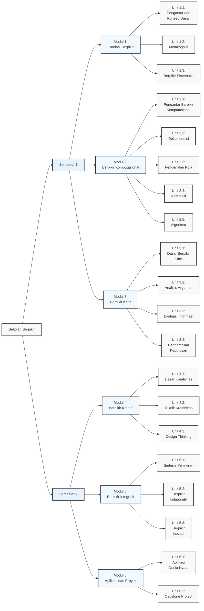

# SEKOLAH BERPIKIR

Kurikulum Program 1 Tahun (40 Minggu Efektif)

---

## MODUL 1: FONDASI BERPIKIR (5 Minggu)

### Unit 1.1: Pengantar dan Konsep Dasar (1 minggu)

#### 1.1.1 Pengertian dan Hakikat Berpikir

- Definisi berpikir
- Tingkatan berpikir
- Proses kognitif dasar
- Perkembangan kemampuan berpikir manusia

#### 1.1.2 Pola Pikir dan Mindset

- Pola pikir berkembang vs pola pikir tetap (Growth mindset vs Fixed mindset)
- Mengembangkan pola pikir positif
- Mengatasi hambatan mental
- Kesadaran diri (Self-awareness) dalam berpikir

### Unit 1.2: Metakognisi (2 minggu)

#### 1.2.1 Dasar Metakognisi

- Pengertian metakognisi
- Komponen metakognisi
- Strategi metakognitif
- Refleksi dan evaluasi diri

#### 1.2.2 Pengembangan Kesadaran Berpikir

- Monitor proses berpikir
- Regulasi kognitif
- Strategi belajar efektif
- Analisis gaya berpikir personal

### Unit 1.3: Berpikir Sistematis (2 minggu)

#### 1.3.1 Fondasi Berpikir Sistematis

- Definisi dan karakteristik
- Pemikiran linier vs sistemik
- Identifikasi komponen sistem
- Analisis hubungan antar komponen

#### 1.3.2 Implementasi Berpikir Sistematis

- Pemetaan sistem
- Diagram sebab-akibat
- Analisis umpan balik (feedback)
- Pemodelan mental (mental modeling)

---

## MODUL 2: BERPIKIR KOMPUTASIONAL (7 Minggu)

### Unit 2.1: Pengantar Berpikir Komputasional (1 minggu)

#### 2.1.1 Konsep Dasar

- Definisi dan sejarah
- Komponen utama
- Manfaat dan aplikasi
- Hubungan dengan bidang lain

#### 2.1.2 Pola Pikir Komputasional

- Karakteristik berpikir komputasional
- Pendekatan sistematis
- Paradigma pemrograman
- Computational thinking mindset

### Unit 2.2: Dekomposisi (2 minggu)

#### 2.2.1 Dasar Dekomposisi

- Pengertian dekomposisi
- Teknik pemecahan masalah
- Identifikasi sub-masalah
- Strategi pecah dan kuasai (divide and conquer)

#### 2.2.2 Praktik Dekomposisi

- Analisis kasus kompleks
- Pemetaan sub-masalah
- Prioritas penyelesaian
- Integrasi solusi

### Unit 2.3: Pengenalan Pola (1 minggu)

#### 2.3.1 Identifikasi Pola

- Pengertian pola
- Jenis-jenis pola
- Teknik pengenalan pola
- Analisis keteraturan

#### 2.3.2 Aplikasi Pengenalan Pola

- Pencocokan pola (pattern matching)
- Prediksi dan peramalan (forecasting)
- Klasifikasi data
- Optimasi proses

### Unit 2.4: Abstraksi (1 minggu)

#### 2.4.1 Konsep Abstraksi

- Pengertian abstraksi
- Level abstraksi
- Pemilihan informasi relevan
- Penyederhanaan masalah

#### 2.4.2 Penerapan Abstraksi

- Pemodelan masalah
- Representasi data
- Generalisasi solusi
- Abstraksi dalam kehidupan sehari-hari

### Unit 2.5: Algoritma (2 minggu)

#### 2.5.1 Dasar Algoritma

- Pengertian algoritma
- Karakteristik algoritma
- Notasi algoritma
- Analisis algoritma

#### 2.5.2 Pengembangan Algoritma

- Desain algoritma
- Flowchart dan pseudocode
- Optimasi algoritma
- Pengujian, pencarian, dan perbaikan masalah (testing dan debugging)

---

## MODUL 3: BERPIKIR KRITIS (8 Minggu)

### Unit 3.1: Dasar Berpikir Kritis (2 minggu)

#### 3.1.1 Konsep Berpikir Kritis

- Definisi dan karakteristik
- Komponen berpikir kritis
- Standar berpikir kritis
- Hambatan berpikir kritis

#### 3.1.2 Pengembangan Mindset Kritis

- Sikap skeptis yang sehat
- Objektivitas
- Keterbukaan pikiran
- Refleksi kritis

### Unit 3.2: Analisis Argumen (2 minggu)

#### 3.2.1 Struktur Argumen

- Komponen argumen
- Premis (dasar pemikiran) dan kesimpulan
- Asumsi tersembunyi
- Keabsahan dan kesahihan (validitas dan soundness)

#### 3.2.2 Evaluasi Argumen

- Analisis logika
- Identifikasi sesat logika (logical fallacy)
- Kekuatan argumentasi
- Argumen tandingan

### Unit 3.3: Evaluasi Informasi (2 minggu)

#### 3.3.1 Sumber Informasi

- Kredibilitas sumber
- Bias dan objektivitas
- Verifikasi fakta
- Rujukan silang (cross-referencing)

#### 3.3.2 Analisis Data

- Interpretasi data
- Statistik dasar
- Korelasi vs kausalitas
- Visualisasi data

### Unit 3.4: Pengambilan Keputusan (2 minggu)

#### 3.4.1 Framework Pengambilan Keputusan

- Model pengambilan keputusan
- Analisis biaya-manfaat (cost-benefit)
- Asesmen risiko
- Matriks keputusan (decision matrix)

#### 3.4.2 Implementasi Keputusan

- Pengumpulan informasi
- Evaluasi alternatif
- Eksekusi keputusan
- Monitoring dan evaluasi

---

## MODUL 4: BERPIKIR KREATIF (6 Minggu)

### Unit 4.1: Dasar Kreativitas (1 minggu)

#### 4.1.1 Memahami Kreativitas

- Definisi kreativitas
- Komponen kreativitas
- Proses kreatif
- Hambatan kreativitas

#### 4.1.2 Mindset Kreatif

- Pengembangan rasa ingin tahu (kuriositas)
- Pengambilan risiko
- Eksperimentasi
- Ketekunan

### Unit 4.2: Teknik Kreativitas (2 minggu)

#### 4.2.1 Berpikir Meluas (Divergent Thinking)

- Brainstorming
- Pemetaan pikiran (mind mapping)
- Asosiasi acak (random association)
- Berpikir lateral

#### 4.2.2 Berpikir Mengerucut (Convergent Thinking)

- Sintesiskan gagasan
- Kriteria seleksi
- Evaluation methods
- Proses penyempurnaan (refinement)

### Unit 4.3: Berpikir Berbasis Rencana (Design Thinking) (3 minggu)

#### 4.3.1 Proses Design Thinking

- Berempati
- Definisikan
- Susun gagasan / ideasi
- Buat prototip
- Uji prototip

#### 4.3.2 Implementasi Design Thinking

- Riset pengguna
- Bingkai masalah
- Kembangkan solusi
- Uji berulang (iteratif)
- Integrasikan umpan balik

---

## MODUL 5: BERPIKIR INTEGRATIF (6 Minggu)

### Unit 5.1: Sintesis Pemikiran (2 minggu)

#### 5.1.1 Integrasi Berbagai Jenis Berpikir

- Kombinasi pendekatan
- Berpikir multiperspektif
- Pendekatan holistik
- Berpikir sistem (systems thinking)

#### 5.1.2 Problem Solving Komprehensif

- Analisis masalah kompleks
- Kembangkan strategi
- Integrasikan solusi
- Rencanakan implementasi

### Unit 5.2: Berpikir Kolaboratif (2 minggu)

#### 5.2.1 Dasar Kolaborasi

- Dinamika tim
- Bagi peran
- Pola komunikasi
- Intelijensia kolektif

#### 5.2.2 Praktik Kolaborasi

- Penyelesaian masalah bersama
- Bangun konsensus
- Resolusi konflik
- Manajemen proyek

### Unit 5.3: Berpikir Inovatif (2 minggu)

#### 5.3.1 Kerangka Kerja Inovasi

- Tipe-tipe inovasi
- Proses inovasi
- Berpikir disruptif
- Berpikir ke masa depan (future thinking)

#### 5.3.2 Implementasi Inovasi

- Identifikasi peluang
- Pengembangan solusi
- Strategi implementasi
- Asesmen Dampak

---

## MODUL 6: APLIKASI DAN PROYEK (8 Minggu)

### Unit 6.1: Aplikasi di Dunia Nyata (3 minggu)

#### 6.1.1 Studi Kasus

- Kasus bisnis
- Problem sosial
- Tantangan teknis
- Isu-isu lingkungan

#### 6.1.2 Proyek Lapangan

- Identifikasi masalah
- Kembangkan solusi
- Implementasi
- Asesmen dampak

### Unit 6.2: Proyek Akhir (5 minggu)

#### 6.2.1 Perencanaan Proyek

- Seleksi topik
- Desain riset
- Metodologi
- Susun linimasa

#### 6.2.2 Evaluasi Proyek

- Implementasi
- Dokumentasi
- Presentasi
- Evaluasi

---

## Metode Evaluasi

1. Penilaian Berkelanjutan
   - Kuis mingguan
   - Tugas individu
   - Proyek kelompok
   - Partisipasi kelas

2. Penilaian Tengah Semester
   - Ujian tertulis
   - Presentasi proyek
   - Asesmen portfolio

3. Penilaian Akhir Semester
   - Ujian final
   - Capstone project
   - Portfolio komprehensif
   - Evaluasi sejawat (peer evaluation)

---

## Sumber Pembelajaran

1. Buku Teks Utama
2. Artikel Jurnal
3. Sumber Daring
4. Studi Kasus
5. Tutorial Video
6. Platform Pembelajaran Interaktif
7. Pengajar Tamu
8. Modul Workshop

---

## Fasilitas Pendukung

1. Sistem Manajemen Pembelajaran (LMS)
2. Piranti Kolaborasi Daring
3. Lingkungan Pembelajaran Virtual (VLE)
4. Perpustakaan Digital
5. Piranti Manajemen Proyek
6. Platform Asesmen

---

---

## DAFTAR REFERENSI

### A. Buku-Buku Utama

#### A.1. Berpikir Komputasional

1. Wing, J. M. (2006). "Computational Thinking." Communications of the ACM, 49(3), 33-35.
2. Denning, P. J., & Tedre, M. (2019). "Computational Thinking." MIT Press.
3. Aho, A. V. (2012). "Computation and Computational Thinking." The Computer Journal, 55(7), 832-835.
4. Selby, C., & Woollard, J. (2013). "Computational Thinking: The Developing Definition." University of Southampton.

#### A.2. Berpikir Kritis

1. Paul, R., & Elder, L. (2019). "Critical Thinking: Tools for Taking Charge of Your Learning and Your Life" (4th ed.). Pearson.
2. Facione, P. A. (2015). "Critical Thinking: What It Is and Why It Counts." Insight Assessment.
3. Kahneman, D. (2011). "Thinking, Fast and Slow." Farrar, Straus and Giroux.
4. Fisher, A. (2011). "Critical Thinking: An Introduction" (2nd ed.). Cambridge University Press.

#### A.3. Berpikir Kreatif

1. De Bono, E. (2015). "Lateral Thinking: Creativity Step by Step." Harper Colophon.
2. Csikszentmihalyi, M. (2013). "Creativity: Flow and the Psychology of Discovery and Invention." Harper Perennial.
3. Robinson, K. (2011). "Out of Our Minds: Learning to be Creative." Capstone.
4. Sawyer, R. K. (2012). "Explaining Creativity: The Science of Human Innovation" (2nd ed.). Oxford University Press.

#### A.4. Design Thinking

1. Brown, T. (2009). "Change by Design: How Design Thinking Transforms Organizations and Inspires Innovation." Harper Business.
2. Lewrick, M., Link, P., & Leifer, L. (2020). "The Design Thinking Toolbox." Wiley.
3. Kelley, T., & Kelley, D. (2013). "Creative Confidence." Crown Business.
4. Liedtka, J., & Ogilvie, T. (2011). "Designing for Growth: A Design Thinking Tool Kit for Managers." Columbia Business School.

### B. Paper dan Artikel Penelitian

#### B.1. Berpikir Komputasional

1. Grover, S., & Pea, R. (2013). "Computational Thinking in K-12: A Review of the State of the Field." Educational Researcher, 42(1), 38-43.
2. Barr, V., & Stephenson, C. (2011). "Bringing Computational Thinking to K-12: What is Involved and What is the Role of the Computer Science Education Community?" ACM Inroads, 2(1), 48-54.
3. Weintrop, D., et al. (2016). "Defining Computational Thinking for Mathematics and Science Classrooms." Journal of Science Education and Technology, 25(1), 127-147.
4. Brennan, K., & Resnick, M. (2012). "New frameworks for studying and assessing the development of computational thinking." AERA.

#### B.2. Berpikir Kritis

1. Ennis, R. H. (2018). "Critical Thinking Across the Curriculum: A Vision." Topoi, 37(1), 165-184.
2. Halpern, D. F. (2014). "Thought and Knowledge: An Introduction to Critical Thinking" (5th ed.). Psychology Press.
3. Abrami, P. C., et al. (2015). "Strategies for Teaching Students to Think Critically: A Meta-Analysis." Review of Educational Research, 85(2), 275-314.
4. Tiruneh, D. T., et al. (2014). "Effectiveness of Critical Thinking Instruction in Higher Education: A Systematic Review of Intervention Studies." Higher Education Studies, 4(1), 1-17.

#### B.3. Metakognisi dan Pembelajaran

1. Flavell, J. H. (1979). "Metacognition and cognitive monitoring: A new area of cognitive-developmental inquiry." American Psychologist, 34(10), 906-911.
2. Veenman, M. V., Van Hout-Wolters, B. H., & Afflerbach, P. (2006). "Metacognition and learning: Conceptual and methodological considerations." Metacognition and Learning, 1(1), 3-14.
3. Schraw, G., & Moshman, D. (1995). "Metacognitive theories." Educational Psychology Review, 7(4), 351-371.
4. Zimmerman, B. J. (2002). "Becoming a Self-Regulated Learner: An Overview." Theory Into Practice, 41(2), 64-70.

#### B.4. Integrasi dan Aplikasi

1. Anderson, L. W., & Krathwohl, D. R. (2001). "A Taxonomy for Learning, Teaching, and Assessing: A Revision of Bloom's Taxonomy of Educational Objectives." Longman.
2. Costa, A. L., & Kallick, B. (2008). "Learning and Leading with Habits of Mind: 16 Essential Characteristics for Success." ASCD.
3. Dweck, C. S. (2006). "Mindset: The New Psychology of Success." Random House.
4. Pink, D. H. (2006). "A Whole New Mind: Why Right-Brainers Will Rule the Future." Riverhead Books.

---

### C. Jurnal Akademik Utama

1. Computers & Education
2. Journal of Educational Psychology
3. Thinking Skills and Creativity
4. Educational Research Review
5. Cognitive Science
6. Journal of Research in Science Teaching
7. International Journal of STEM Education
8. ACM Transactions on Computing Education

---

### D. Sumber Online Terpercaya

1. MIT OpenCourseWare (ocw.mit.edu)
2. Harvard Online Learning (online-learning.harvard.edu)
3. Stanford Online (online.stanford.edu)
4. Coursera - Learning How to Learn (coursera.org)
5. edX - Critical Thinking Courses (edx.org)
6. Google for Education - Computational Thinking (edu.google.com)
7. CS Unplugged (csunplugged.org)
8. Code.org (code.org)
