# Etika Nusantara: Teroka dan Rekonstruksi Nilai Moral Manusia Indonesia

## Daftar Isi

- [Etika Nusantara: Teroka dan Rekonstruksi Nilai Moral Manusia Indonesia](#etika-nusantara-teroka-dan-rekonstruksi-nilai-moral-manusia-indonesia)
  - [Daftar Isi](#daftar-isi)
  - [Diagram Isi](#diagram-isi)
  - [Pendahuluan](#pendahuluan)
    - [Prakata](#prakata)
    - [Kata Pengantar](#kata-pengantar)
  - [Bagian I: Pencarian Akar dan Kekayaan Nilai](#bagian-i-pencarian-akar-dan-kekayaan-nilai)
    - [Bab 1: Menapaki Jejak Sejarah Moral Nusantara](#bab-1-menapaki-jejak-sejarah-moral-nusantara)
      - [1.1. Cerita rakyat dan pepatah](#11-cerita-rakyat-dan-pepatah)
      - [1.2. Ritual dan tradisi adat](#12-ritual-dan-tradisi-adat)
      - [1.3. Perpaduan budaya (Hindu-Buddha, Islam, kepercayaan lokal)](#13-perpaduan-budaya-hindu-buddha-islam-kepercayaan-lokal)
    - [Bab 2: Warisan Gotong Royong dan Musyawarah](#bab-2-warisan-gotong-royong-dan-musyawarah)
      - [2.1. Filosofi gotong royong dalam kehidupan sehari-hari](#21-filosofi-gotong-royong-dalam-kehidupan-sehari-hari)
      - [2.2. Musyawarah: dari rapat kampung ke diskusi modern](#22-musyawarah-dari-rapat-kampung-ke-diskusi-modern)
      - [2.3. Cerita inspiratif tentang solidaritas](#23-cerita-inspiratif-tentang-solidaritas)
    - [Bab 3: Harmoni Alam dan Spiritualitas dalam Budaya](#bab-3-harmoni-alam-dan-spiritualitas-dalam-budaya)
      - [3.1. Hubungan manusia dengan alam](#31-hubungan-manusia-dengan-alam)
      - [3.2. Upacara dan kepercayaan yang menghubungkan spiritualitas](#32-upacara-dan-kepercayaan-yang-menghubungkan-spiritualitas)
      - [3.3. Nilai kesederhanaan dalam kehidupan](#33-nilai-kesederhanaan-dalam-kehidupan)
  - [Bagian II: Tantangan Zaman dan Transformasi Nilai](#bagian-ii-tantangan-zaman-dan-transformasi-nilai)
    - [Bab 4: Modernitas dan Globalisasi: Ujian Nilai Tradisional](#bab-4-modernitas-dan-globalisasi-ujian-nilai-tradisional)
      - [4.1. Pergeseran kehidupan di era digital](#41-pergeseran-kehidupan-di-era-digital)
      - [4.2. Dampak individualisme dan konsumtivitas](#42-dampak-individualisme-dan-konsumtivitas)
      - [4.3. Refleksi perubahan nilai melalui cerita masyarakat](#43-refleksi-perubahan-nilai-melalui-cerita-masyarakat)
    - [Bab 5: Rekonstruksi Moral di Tengah Arus Perubahan](#bab-5-rekonstruksi-moral-di-tengah-arus-perubahan)
      - [5.1. Adaptasi nilai gotong royong dalam dunia kerja modern](#51-adaptasi-nilai-gotong-royong-dalam-dunia-kerja-modern)
      - [5.2. Transformasi musyawarah ke era digital](#52-transformasi-musyawarah-ke-era-digital)
      - [5.3. Integrasi tradisi dan inovasi dalam kehidupan urban](#53-integrasi-tradisi-dan-inovasi-dalam-kehidupan-urban)
    - [Bab 6: Keterbukaan dan Dinamika Generasi Muda](#bab-6-keterbukaan-dan-dinamika-generasi-muda)
      - [6.1. Peran generasi milenial dan Gen Z dalam menghidupkan nilai tradisional](#61-peran-generasi-milenial-dan-gen-z-dalam-menghidupkan-nilai-tradisional)
      - [6.2. Pendidikan karakter dan peran media](#62-pendidikan-karakter-dan-peran-media)
      - [6.3. Harapan dan tantangan moral di masa depan](#63-harapan-dan-tantangan-moral-di-masa-depan)
  - [Bagian III: Rekonstruksi dan Penerapan Nilai Moral](#bagian-iii-rekonstruksi-dan-penerapan-nilai-moral)
    - [Bab 7: Etika dalam Kehidupan Sehari-hari](#bab-7-etika-dalam-kehidupan-sehari-hari)
      - [7.1. Kisah nyata penerapan nilai moral di lingkungan kerja, keluarga, dan komunitas](#71-kisah-nyata-penerapan-nilai-moral-di-lingkungan-kerja-keluarga-dan-komunitas)
      - [7.2. Cerita dan seni sebagai media penyebaran nilai luhur](#72-cerita-dan-seni-sebagai-media-penyebaran-nilai-luhur)
      - [7.3. Praktik ritual kebersamaan](#73-praktik-ritual-kebersamaan)
    - [Bab 8: Institusi dan Komunitas sebagai Agen Rekonstruksi](#bab-8-institusi-dan-komunitas-sebagai-agen-rekonstruksi)
      - [8.1. Transformasi koperasi dan ekonomi kerakyatan](#81-transformasi-koperasi-dan-ekonomi-kerakyatan)
      - [8.2. Peran lembaga sosial dan pemerintah lokal](#82-peran-lembaga-sosial-dan-pemerintah-lokal)
      - [8.3. Cerita sukses komunitas](#83-cerita-sukses-komunitas)
    - [Bab 9: Menuju Masa Depan: Etika Nusantara di Era Digital](#bab-9-menuju-masa-depan-etika-nusantara-di-era-digital)
      - [9.1. Integrasi teknologi dan kearifan lokal](#91-integrasi-teknologi-dan-kearifan-lokal)
      - [9.2. Etika digital sebagai perpanjangan nilai tradisional](#92-etika-digital-sebagai-perpanjangan-nilai-tradisional)
      - [9.3. Visi masyarakat humanis di era global](#93-visi-masyarakat-humanis-di-era-global)
  - [Bagian IV: Refleksi dan Dialog](#bagian-iv-refleksi-dan-dialog)
    - [Bab 10: Dialog Moral: Antara Tradisi dan Modernitas](#bab-10-dialog-moral-antara-tradisi-dan-modernitas)
      - [10.1. Wawancara dan cerita dialog dengan tokoh masyarakat](#101-wawancara-dan-cerita-dialog-dengan-tokoh-masyarakat)
      - [10.2. Perdebatan santai tentang makna moral masa kini](#102-perdebatan-santai-tentang-makna-moral-masa-kini)
      - [10.3. Renungan dan ajakan berpikir kritis](#103-renungan-dan-ajakan-berpikir-kritis)
    - [Bab 11: Refleksi Akhir: Menyatukan Masa Lalu, Kini, dan Esok](#bab-11-refleksi-akhir-menyatukan-masa-lalu-kini-dan-esok)
      - [11.1. Kesimpulan perjalanan pencarian nilai moral](#111-kesimpulan-perjalanan-pencarian-nilai-moral)
      - [11.2. Pesan untuk pembaca](#112-pesan-untuk-pembaca)
      - [11.3. Catatan penutup](#113-catatan-penutup)
  - [Lampiran dan Catatan](#lampiran-dan-catatan)
    - [Lampiran 1. Cerita pendek, anekdot, dan puisi tentang kearifan lokal](#lampiran-1-cerita-pendek-anekdot-dan-puisi-tentang-kearifan-lokal)
    - [Lampiran 2. Referensi bacaan dan rekomendasi film/dokumenter](#lampiran-2-referensi-bacaan-dan-rekomendasi-filmdokumenter)
    - [Lampiran 3. Catatan penulis](#lampiran-3-catatan-penulis)

## Diagram Isi

```mermaid
graph LR

    A[Etika Nusantara: Teroka dan Rekonstruksi Nilai Moral Manusia Indonesia] --> G[Pendahuluan]
    A --> B[Bagian I: Pencarian Akar dan Kekayaan Nilai]
    A --> C[Bagian II: Tantangan Zaman dan Transformasi Nilai]
    A --> D[Bagian III: Rekonstruksi dan Penerapan Nilai Moral]
    A --> E[Bagian IV: Refleksi dan Dialog]
    A --> F[Lampiran dan Catatan]

    G --> G1[Prakata]
    G --> G2[Kata Pengantar]
    
    B --> B1[Bab 1: Menapaki Jejak Sejarah Moral Nusantara]
    B --> B2[Bab 2: Warisan Gotong Royong dan Musyawarah]
    B --> B3[Bab 3: Harmoni Alam dan Spiritualitas dalam Budaya]
    
    C --> C1[Bab 4: Modernitas dan Globalisasi]
    C --> C2[Bab 5: Rekonstruksi Moral di Tengah Arus Perubahan]
    C --> C3[Bab 6: Keterbukaan dan Dinamika Generasi Muda]
    
    D --> D1[Bab 7: Etika dalam Kehidupan Sehari-hari]
    D --> D2[Bab 8: Institusi dan Komunitas sebagai Agen Rekonstruksi]
    D --> D3[Bab 9: Menuju Masa Depan: Etika Nusantara di Era Digital]
    
    E --> E1[Bab 10: Dialog Moral: Antara Tradisi dan Modernitas]
    E --> E2[Bab 11: Refleksi Akhir: Menyatukan Masa Lalu, Kini, dan Esok]
    
    F --> F1[Lampiran 1: Cerita pendek, anekdot, dan puisi]
    F --> F2[Lampiran 2: Referensi bacaan dan rekomendasi film]
    F --> F3[Lampiran 3: Catatan penulis]
    
    %% Bab 1 Sub-sections
    B1 --> B11[1.1 Cerita rakyat dan pepatah]
    B1 --> B12[1.2 Ritual dan tradisi adat]
    B1 --> B13[1.3 Perpaduan budaya]
    
    %% Bab 2 Sub-sections
    B2 --> B21[2.1 Filosofi gotong royong]
    B2 --> B22[2.2 Musyawarah]
    B2 --> B23[2.3 Cerita inspiratif]
    
    %% Bab 3 Sub-sections
    B3 --> B31[3.1 Hubungan manusia dengan alam]
    B3 --> B32[3.2 Upacara dan kepercayaan]
    B3 --> B33[3.3 Nilai kesederhanaan]
    
    %% Bab 4 Sub-sections
    C1 --> C11[4.1 Pergeseran era digital]
    C1 --> C12[4.2 Dampak individualisme]
    C1 --> C13[4.3 Refleksi perubahan nilai]
    
    %% Bab 5 Sub-sections
    C2 --> C21[5.1 Adaptasi gotong royong]
    C2 --> C22[5.2 Transformasi musyawarah]
    C2 --> C23[5.3 Integrasi tradisi dan inovasi]
    
    %% Bab 6 Sub-sections
    C3 --> C31[6.1 Peran generasi muda]
    C3 --> C32[6.2 Pendidikan karakter]
    C3 --> C33[6.3 Tantangan moral masa depan]
    
    %% Bab 7 Sub-sections
    D1 --> D11[7.1 Kisah nyata penerapan nilai]
    D1 --> D12[7.2 Cerita dan seni]
    D1 --> D13[7.3 Praktik ritual kebersamaan]
    
    %% Bab 8 Sub-sections
    D2 --> D21[8.1 Transformasi koperasi]
    D2 --> D22[8.2 Peran lembaga sosial]
    D2 --> D23[8.3 Cerita sukses komunitas]
    
    %% Bab 9 Sub-sections
    D3 --> D31[9.1 Integrasi teknologi]
    D3 --> D32[9.2 Etika digital]
    D3 --> D33[9.3 Visi masyarakat humanis]
    
    %% Bab 10 Sub-sections
    E1 --> E11[10.1 Wawancara tokoh]
    E1 --> E12[10.2 Perdebatan moral]
    E1 --> E13[10.3 Renungan kritis]
    
    %% Bab 11 Sub-sections
    E2 --> E21[11.1 Kesimpulan pencarian]
    E2 --> E22[11.2 Pesan pembaca]
    E2 --> E23[11.3 Catatan penutup]
```

## Pendahuluan

### Prakata

### Kata Pengantar

## Bagian I: Pencarian Akar dan Kekayaan Nilai

### Bab 1: Menapaki Jejak Sejarah Moral Nusantara

#### 1.1. Cerita rakyat dan pepatah

#### 1.2. Ritual dan tradisi adat

#### 1.3. Perpaduan budaya (Hindu-Buddha, Islam, kepercayaan lokal)

### Bab 2: Warisan Gotong Royong dan Musyawarah

#### 2.1. Filosofi gotong royong dalam kehidupan sehari-hari

#### 2.2. Musyawarah: dari rapat kampung ke diskusi modern

#### 2.3. Cerita inspiratif tentang solidaritas

### Bab 3: Harmoni Alam dan Spiritualitas dalam Budaya

#### 3.1. Hubungan manusia dengan alam

#### 3.2. Upacara dan kepercayaan yang menghubungkan spiritualitas

#### 3.3. Nilai kesederhanaan dalam kehidupan

## Bagian II: Tantangan Zaman dan Transformasi Nilai

### Bab 4: Modernitas dan Globalisasi: Ujian Nilai Tradisional

#### 4.1. Pergeseran kehidupan di era digital

#### 4.2. Dampak individualisme dan konsumtivitas

#### 4.3. Refleksi perubahan nilai melalui cerita masyarakat

### Bab 5: Rekonstruksi Moral di Tengah Arus Perubahan

#### 5.1. Adaptasi nilai gotong royong dalam dunia kerja modern

#### 5.2. Transformasi musyawarah ke era digital

#### 5.3. Integrasi tradisi dan inovasi dalam kehidupan urban

### Bab 6: Keterbukaan dan Dinamika Generasi Muda

#### 6.1. Peran generasi milenial dan Gen Z dalam menghidupkan nilai tradisional

#### 6.2. Pendidikan karakter dan peran media

#### 6.3. Harapan dan tantangan moral di masa depan

## Bagian III: Rekonstruksi dan Penerapan Nilai Moral

### Bab 7: Etika dalam Kehidupan Sehari-hari

#### 7.1. Kisah nyata penerapan nilai moral di lingkungan kerja, keluarga, dan komunitas

#### 7.2. Cerita dan seni sebagai media penyebaran nilai luhur

#### 7.3. Praktik ritual kebersamaan

### Bab 8: Institusi dan Komunitas sebagai Agen Rekonstruksi

#### 8.1. Transformasi koperasi dan ekonomi kerakyatan

#### 8.2. Peran lembaga sosial dan pemerintah lokal

#### 8.3. Cerita sukses komunitas

### Bab 9: Menuju Masa Depan: Etika Nusantara di Era Digital

#### 9.1. Integrasi teknologi dan kearifan lokal

#### 9.2. Etika digital sebagai perpanjangan nilai tradisional

#### 9.3. Visi masyarakat humanis di era global

## Bagian IV: Refleksi dan Dialog

### Bab 10: Dialog Moral: Antara Tradisi dan Modernitas

#### 10.1. Wawancara dan cerita dialog dengan tokoh masyarakat

#### 10.2. Perdebatan santai tentang makna moral masa kini

#### 10.3. Renungan dan ajakan berpikir kritis

### Bab 11: Refleksi Akhir: Menyatukan Masa Lalu, Kini, dan Esok

#### 11.1. Kesimpulan perjalanan pencarian nilai moral

#### 11.2. Pesan untuk pembaca

#### 11.3. Catatan penutup

## Lampiran dan Catatan

### Lampiran 1. Cerita pendek, anekdot, dan puisi tentang kearifan lokal

### Lampiran 2. Referensi bacaan dan rekomendasi film/dokumenter

### Lampiran 3. Catatan penulis
