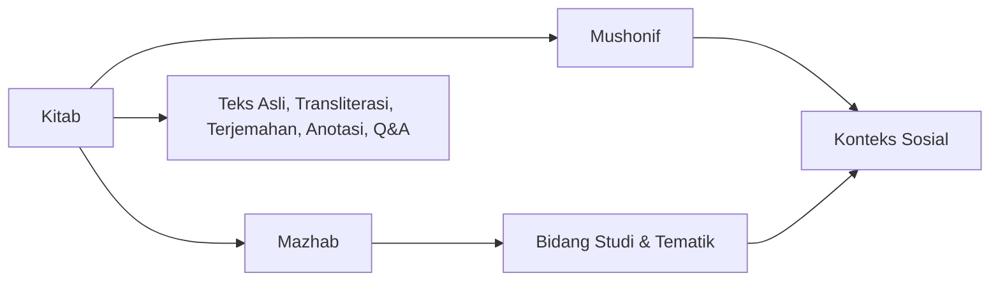
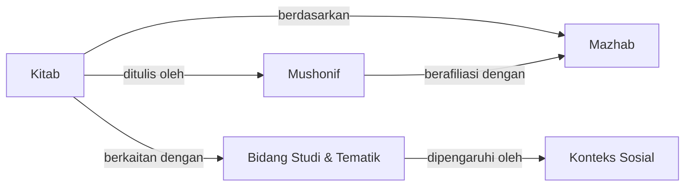
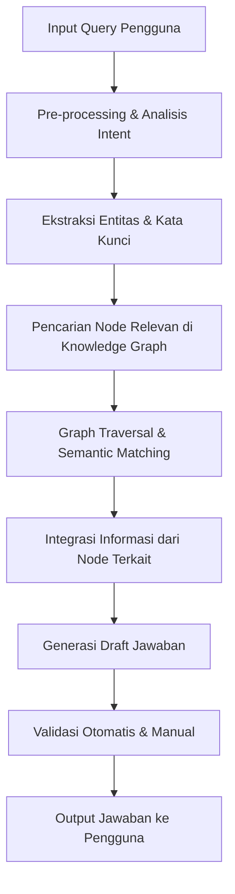

# Metode Pengembangan Knowledge Graph untuk Kitab-Kitab Islam

## Pendahuluan

Metode knowledge graph merupakan pendekatan holistik untuk mengelola dan mengaitkan informasi keilmuan dari kitab-kitab Islam. Dengan memanfaatkan struktur graf, sistem ini mengorganisasikan entitas–entitas utama seperti:

- **Kitab**: Menyimpan informasi tentang teks asli, transliterasi, terjemahan, anotasi, dan Q&A.
- **Mushonif**: Data penulis kitab yang mencakup biografi, latar belakang keilmuan, serta konteks sosial dan budaya.
- **Mazhab**: Aliran pemikiran dan interpretasi keilmuan, yang memberikan kerangka bagi perbedaan pendapat.
- **Bidang Studi dan Tematik Islam**: Kategori seperti fiqh, ushul fiqh, tasawuf, nahwu, dan lain-lain.
- **Konteks Sosial**: Informasi historis, budaya, dan politik yang mempengaruhi penulisan kitab dan pemikiran mushonif.

Pendekatan ini tidak hanya mengaitkan data secara struktural tetapi juga menyediakan dasar untuk validasi, pencarian intertekstual, dan integrasi dengan sistem Q&A serta AI.

---

## Argumentasi dan Keunggulan Knowledge Graph

1. **Interkonektivitas Data**  
   Knowledge graph memetakan hubungan antar entitas (misal: kitab terhubung ke mushonif, yang pada gilirannya berasosiasi dengan mazhab dan bidang studi tertentu). Hal ini memungkinkan penelusuran lintas sumber yang kaya dan mendalam.

2. **Validasi dan Otentisitas**  
   Dengan mengintegrasikan anotasi dan Q&A yang telah tervalidasi oleh ulama ke dalam node kitab, sistem dapat memastikan keakuratan informasi serta menjaga integritas sanad keilmuan.

3. **Dukungan Multibahasa dan Multiformat**  
   Node kitab mendukung teks asli dalam berbagai aksara (Arab, Pegon, Jawi) dan bahasa (Arab, Jawa, Sunda, Melayu), beserta transliterasi ke huruf Latin dan terjemahan dalam bahasa Indonesia. Ini meningkatkan aksesibilitas dan pemahaman.

4. **Pengelolaan Dinamis dan Revisi**  
   Knowledge graph memungkinkan penyimpanan versi historis dan metadata seperti edisi, tanggal penulisan, serta konteks sosial, sehingga memudahkan pembaruan seiring dengan perkembangan ilmu dan penemuan naskah baru.

5. **Integrasi dengan Sistem AI**  
   Struktur yang terhubung secara semantik mendukung sistem Q&A, Retrieval-Augmented Generation (RAG), dan modul validasi berbasis aturan, sehingga AI dapat menghasilkan jawaban yang terverifikasi dan kontekstual.

---

## Cara Kerja Sistem

### Struktur Node Utama

**Node Kitab:**  
- **Teks Asli:** Teks kitab dalam aksara asli (misalnya Arab, Pegon, Jawi).  
- **Transliterasi:** Konversi teks ke huruf Latin.  
- **Terjemahan:** Versi dalam bahasa Indonesia atau bahasa lain.  
- **Anotasi:** Catatan penjelasan, komentar, dan referensi ulama.  
- **Q&A:** Data pertanyaan dan jawaban yang telah tervalidasi.

**Node Mushonif:**  
- **Biografi:** Riwayat hidup dan latar belakang pendidikan.  
- **Konteks Sosial:** Informasi mengenai kondisi sosial dan budaya pada masa penulisan.

**Node Mazhab:**  
- **Definisi & Prinsip:** Karakteristik dan metodologi masing-masing mazhab.  
- **Relasi:** Hubungan dengan mushonif dan pengaruh terhadap kitab.

**Node Bidang Studi dan Tematik:**  
- **Kategori Utama:** Fiqh, ushul fiqh, tasawuf, nahwu, dll.  
- **Sub-kategori:** Topik-topik lebih spesifik dalam setiap bidang studi.

**Node Konteks Sosial:**  
- **Historis:** Kondisi politik, ekonomi, dan sosial pada masa kitab ditulis.  
- **Budaya:** Nilai-nilai dan norma yang mempengaruhi pemikiran keilmuan.

### Diagram Hubungan Node



---

## Alur Pengembangan Knowledge Graph

1. **Koleksi Data:**  
   - **Pengumpulan Sumber Primer:** Mengumpulkan teks kitab, manuskrip, data biografi mushonif, referensi mazhab, dan metadata historis.
   - **Digitalisasi:** Proses digitalisasi naskah dan data yang tersedia.

2. **Ekstraksi dan Normalisasi:**  
   - **Ekstraksi Teks:** Mengambil teks asli, transliterasi, dan terjemahan menggunakan teknik OCR dan pemrosesan teks.
   - **Normalisasi Data:** Menstandarisasi format data untuk konsistensi antar sumber.

3. **Pembuatan Node dan Relasi:**  
   - **Definisi Node:** Membangun entitas untuk setiap elemen (kitab, mushonif, dsb.) dengan atribut metadata lengkap.
   - **Penentuan Relasi:** Menghubungkan node berdasarkan hubungan historis, keilmuan, dan kontekstual (misalnya, kitab "ditulis oleh" mushonif, mushonif "berafiliasi dengan" mazhab).

4. **Integrasi Q&A dan Anotasi:**  
   - **Validasi Ulama:** Menyertakan data Q&A yang telah tervalidasi oleh para ahli dan mengaitkannya dengan node kitab.
   - **Anotasi Tambahan:** Menambahkan komentar dan catatan ulama pada teks kitab untuk mendukung pemahaman.

5. **Pengembangan Ontologi Keilmuan Islam:**  
   - **Definisi Konsep:** Menyusun ontologi yang mendefinisikan hubungan antar konsep keilmuan seperti ijtihad, qiyas, dan istihsan.
   - **Semantic Tagging:** Mengimplementasikan semantic tagging dengan RDF atau OWL agar data dapat diproses secara otomatis dan interoperabel.

6. **Iterasi dan Feedback:**  
   - **Review Berkala:** Proses evaluasi dan revisi oleh ulama dan pengguna.
   - **Pembaruan Dinamis:** Menyimpan versi-versi revisi untuk menjaga integritas data seiring dengan perkembangan ilmu.

---

## Contoh Pseudocode Pengembangan Node

```python
class Node:
    def __init__(self, id, type, attributes):
        self.id = id
        self.type = type  # Misal: 'kitab', 'mushonif', 'mazhab'
        self.attributes = attributes
        self.relations = {}

    def add_relation(self, relation_type, node):
        if relation_type not in self.relations:
            self.relations[relation_type] = []
        self.relations[relation_type].append(node)

# Pembuatan node untuk sebuah kitab
kitab_node = Node("K001", "kitab", {
    "teks_asli": "نص الكتاب الأصلي...",
    "transliterasi": "Nas al-kitab al-asli...",
    "terjemahan": "Teks terjemahan dalam Bahasa Indonesia",
    "anotasi": "Catatan-catatan penting dan referensi ulama...",
    "qna": [{"pertanyaan": "Apa makna X?", "jawaban": "Penjelasan Y"}]
})

# Pembuatan node untuk mushonif
mushonif_node = Node("M001", "mushonif", {
    "nama": "Imam XYZ",
    "biografi": "Riwayat hidup, pendidikan, dan latar belakang..."
})

# Menambahkan relasi antara kitab dan mushonif
kitab_node.add_relation("ditulis_oleh", mushonif_node)
```

---

## Integrasi dengan Sistem AI dan Q&A

Setelah knowledge graph dibangun, sistem AI dapat menggunakannya untuk:

- **Penelusuran Kontekstual:** Mengambil informasi relevan dari node–node yang saling terhubung untuk menjawab pertanyaan secara mendalam.
- **Validasi Jawaban:** Menggunakan data Q&A dan anotasi untuk memastikan jawaban yang dihasilkan konsisten dengan otoritas keilmuan.
- **Augmented Generation:** Menggabungkan teks asli, anotasi, dan metadata dari graph sebagai konteks dalam generative model untuk menghasilkan jawaban yang terverifikasi.

### Alur Kerja Query-Response

1. **Input Pertanyaan:**  
   Pengguna mengajukan pertanyaan melalui antarmuka sistem.

2. **Penelusuran Graph:**  
   Sistem mencari node relevan (misal, kitab dan mushonif terkait) berdasarkan kata kunci dan relasi semantik.

3. **Pengumpulan Konteks:**  
   Data dari berbagai node (teks asli, anotasi, Q&A) diintegrasikan untuk membentuk konteks yang lengkap.

4. **Penyusunan Jawaban:**  
   Sistem AI, misalnya RAG atau model generatif lainnya, mengolah konteks tersebut untuk menyusun jawaban.

5. **Validasi dan Feedback:**  
   Jawaban yang dihasilkan diverifikasi melalui mekanisme validasi (ulasan ulama dan sistem rating pengguna), lalu diperbarui jika diperlukan ke dalam knowledge graph.

---

## Kesimpulan

Metode knowledge graph untuk kitab-kitab Islam ini menyediakan kerangka kerja yang komprehensif dan dinamis untuk mengelola serta mengaitkan berbagai sumber keilmuan. Dengan menggabungkan data teks asli, transliterasi, terjemahan, anotasi, dan Q&A yang tervalidasi, sistem mampu memberikan jawaban yang otentik dan kontekstual. Pendekatan ini tidak hanya meningkatkan keakuratan dan transparansi, tetapi juga mendukung integrasi dengan teknologi AI modern untuk menghasilkan output yang berkualitas dan adaptif terhadap perkembangan ilmu keislaman.

---

# Proses Penyusunan Knowledge Graph: Peran Tim IT dan Tim Riset Data

Penyusunan knowledge graph untuk kitab-kitab Islam merupakan upaya kolaboratif yang melibatkan dua tim utama: **Tim IT** dan **Tim Riset Data**. Masing-masing tim memiliki peran spesifik dalam setiap tahap, mulai dari pengumpulan data hingga implementasi dan pemeliharaan sistem. Berikut adalah detil proses penyusunan secara teknis:

---

## 1. Pengumpulan dan Ekstraksi Data

### Tim Riset Data:
- **Identifikasi Sumber**: Mengumpulkan data dari berbagai sumber primer dan sekunder, seperti manuskrip, edisi digital, katalog perpustakaan, database hadis, biografi mushonif, dan referensi fatwa.
- **Kualifikasi Sumber**: Menentukan keabsahan dan relevansi data yang diperoleh dengan melakukan review literatur dan konsultasi dengan ahli keilmuan.
- **Ekstraksi Informasi**: Menggunakan teknik NLP (Natural Language Processing) untuk mengekstrak entitas utama seperti:
  - Nama kitab, mushonif, mazhab, bidang studi, dan konteks historis.
  - Teks asli, transliterasi, dan terjemahan.
  - Anotasi, catatan kaki, dan Q&A dari ulama.

### Tim IT:
- **Pengumpulan Digital**: Memastikan data yang dikumpulkan telah didigitalkan dengan format yang sesuai (misal: PDF, XML, JSON).
- **Integrasi Data**: Menyusun pipeline untuk mengimpor data mentah ke dalam sistem basis data untuk proses selanjutnya.

---

## 2. Pre-processing dan Normalisasi Data

### Tim Riset Data:
- **Pembersihan Data**: Membersihkan teks dari noise (kesalahan OCR, karakter yang tidak valid) dan melakukan normalisasi (misalnya konversi aksara Pegon/Jawi ke format standar).
- **Standardisasi Metadata**: Menetapkan format metadata seperti tanggal penulisan, lokasi, dan kategori keilmuan agar konsisten antar sumber.

### Tim IT:
- **Implementasi Pipeline ETL**: Merancang dan mengembangkan proses Extract, Transform, Load (ETL) untuk memproses data mentah menjadi data yang siap diintegrasikan ke dalam knowledge graph.
- **Automasi Pre-processing**: Menggunakan skrip dan tools (misal: Python, Apache Spark) untuk mengotomatisasi pembersihan dan transformasi data.

---

## 3. Ekstraksi Entitas dan Anotasi

### Tim Riset Data:
- **Named Entity Recognition (NER)**: Menggunakan model NLP untuk mengidentifikasi entitas seperti nama kitab, mushonif, mazhab, dan istilah keilmuan.
- **Anotasi Manual dan Semi-Otomatis**: Melakukan validasi entitas hasil ekstraksi dengan melibatkan ahli (ulama) untuk memberikan anotasi dan validasi Q&A.
- **Pemetaan Relasi Awal**: Menentukan hubungan antar entitas berdasarkan konteks historis, isi kitab, dan ulasan para ahli.

### Tim IT:
- **Integrasi Model NLP**: Mengimplementasikan model machine learning untuk NER dan ekstraksi relasi dalam pipeline data.
- **API dan Tools Anotasi**: Mengembangkan antarmuka untuk kolaborasi antara tim riset data dan ulama dalam menambahkan atau mengoreksi anotasi.

---

## 4. Penyusunan Ontologi dan Struktur Graph

### Tim Riset Data:
- **Perancangan Ontologi**: Menyusun ontologi keilmuan Islam yang mendefinisikan kelas (kitab, mushonif, mazhab, dsb.) dan properti antar entitas. Ontologi ini menentukan:
  - **Hierarki**: Misalnya, kategori utama seperti fiqh yang memiliki sub-kategori (ibadah, muamalah, dsb.).
  - **Relasi**: Hubungan seperti "ditulis oleh", "terkait dengan", dan "dikutip dari".

### Tim IT:
- **Modeling Graph**: Mengkonversi ontologi yang telah disusun menjadi skema graph. Tools seperti Neo4j, GraphDB, atau RDF store (misalnya, Apache Jena) digunakan untuk menyimpan dan mengelola data.
- **Pembuatan Schema**: Menentukan node, edge, dan atribut yang akan digunakan. Contoh struktur node:
  - **Node Kitab**: Berisi teks asli, transliterasi, terjemahan, anotasi, dan Q&A.
  - **Node Mushonif**: Berisi biografi, konteks sosial, dan karya-karya lain.
  - **Node Mazhab & Bidang Studi**: Menjelaskan kategori dan prinsip keilmuan.
  
**Diagram Sederhana Ontologi:**



---

## 5. Implementasi dan Pengembangan Knowledge Graph

### Tim IT:
- **Pembangunan Graph Database**: Menginstal dan mengkonfigurasi graph database (misalnya, Neo4j) dan mengimpor data menggunakan format yang disepakati (CSV, JSON, RDF).
- **Integrasi API**: Mengembangkan API untuk akses, query, dan update knowledge graph oleh aplikasi front-end atau modul AI (misal: sistem Q&A dan RAG).
- **Automasi Sinkronisasi Data**: Membuat sistem yang mengintegrasikan data terbaru dari pipeline ETL secara berkala agar graph selalu terbarui.

### Tim Riset Data:
- **Validasi Konten**: Bekerja sama dengan tim IT untuk memastikan integritas data yang diimpor sesuai dengan ontologi dan relasi yang telah dirancang.
- **Uji Coba dan Evaluasi**: Melakukan evaluasi kualitas graph dengan simulasi query dan feedback dari ahli untuk memastikan relevansi dan akurasi.

---

## 6. Validasi, Umpan Balik, dan Iterasi

### Kolaborasi Bersama:
- **Review Periodik**: Tim IT dan tim riset data secara berkala mengadakan review bersama dengan melibatkan para ulama untuk menilai keakuratan knowledge graph.
- **Feedback Loop**: Umpan balik dari pengguna dan ahli diterima melalui sistem rating, komentar, dan sesi validasi langsung. Perubahan dan revisi diterapkan dalam iterasi berikutnya.
- **Penyimpanan Versi**: Setiap perubahan direkam sehingga versi historis graph dapat diakses untuk keperluan audit dan analisis perkembangan.

---

## 7. Dokumentasi dan Pemeliharaan

### Tim IT:
- **Dokumentasi Teknis**: Menyusun dokumentasi lengkap mengenai skema graph, API, pipeline ETL, dan integrasi sistem.
- **Monitoring dan Maintenance**: Mengimplementasikan sistem monitoring untuk performa database dan melakukan backup serta pemeliharaan rutin.

### Tim Riset Data:
- **Dokumentasi Data**: Menyusun dokumentasi terkait sumber data, proses ekstraksi, metodologi anotasi, dan revisi konten.
- **Pelatihan dan Sosialisasi**: Menyediakan training bagi pengguna internal dan ahli untuk memahami cara kerja knowledge graph dan bagaimana mengakses informasi.

---

## Kesimpulan

Proses penyusunan knowledge graph untuk kitab-kitab Islam adalah inisiatif multidisipliner yang melibatkan:
- **Tim Riset Data**: Fokus pada pengumpulan, ekstraksi, anotasi, dan validasi konten keilmuan.
- **Tim IT**: Bertanggung jawab atas implementasi teknis, pengembangan pipeline, penyusunan database graph, dan integrasi sistem.

Kolaborasi erat antara kedua tim, didukung oleh feedback dari para ulama dan pengguna, menjamin bahwa knowledge graph yang dibangun tidak hanya komprehensif dan terstruktur, tetapi juga akurat dan relevan dengan kebutuhan keilmuan Islam masa kini.

---

# Logika Pemrosesan Query hingga Respons dengan Knowledge Graph

Metode ini mengandalkan struktur knowledge graph untuk menyatukan berbagai entitas keilmuan, sehingga dapat menghasilkan jawaban yang kontekstual dan terverifikasi. Berikut adalah penjelasan lengkap mengenai algoritma dan logika pemrosesan query, beserta argumen mengenai efektivitas pendekatan ini.

---

## 1. Alur Kerja Pemrosesan Query

### Langkah-langkah Utama

1. **Input Query Pengguna**  
   Pengguna mengajukan pertanyaan melalui antarmuka sistem. Contoh: "Apa penjelasan tentang konsep ijtihad dalam kitab X?"

2. **Pre-processing dan Analisis Intent**  
   - **Tokenisasi dan Normalisasi:** Query dipecah menjadi kata-kata kunci, dilakukan normalisasi (misal, penghilangan tanda baca, konversi ke format standar).
   - **Analisis Semantik:** Menggunakan model NLP untuk memahami maksud dan konteks pertanyaan serta mengekstrak entitas kunci (misalnya, nama kitab, istilah keilmuan).

3. **Pencarian Semantic di Knowledge Graph**  
   - **Identifikasi Node Relevan:** Berdasarkan entitas yang diekstraksi, sistem mencari node yang relevan dalam graph, seperti node *kitab*, *mushonif*, *bidang studi*, atau *mazhab*.
   - **Graph Traversal:** Algoritma traversal berjalan untuk mengambil semua node terkait berdasarkan relasi yang telah ditetapkan, misalnya "ditulis oleh", "berkaitan dengan", atau "berdasarkan".

4. **Integrasi Informasi dan Penyusunan Konteks**  
   - **Penggabungan Data:** Data dari node terkait (teks asli, transliterasi, terjemahan, anotasi, Q&A) diintegrasikan untuk membentuk konteks komprehensif.
   - **Penyusunan Draft Jawaban:** Berdasarkan konteks yang terkumpul, sistem menyusun draft jawaban yang mencakup referensi dan catatan pendukung.

5. **Validasi Jawaban**  
   - **Automated Verification:** Proses verifikasi otomatis memeriksa konsistensi dan relevansi jawaban. Bila perlu, flag untuk review manual oleh ulama.
   - **Feedback Loop:** Jawaban yang telah divalidasi dapat disimpan sebagai bagian dari data Q&A, memperkaya graph untuk query berikutnya.

6. **Output Jawaban ke Pengguna**  
   Jawaban akhir disajikan kepada pengguna, disertai dengan referensi ke sumber dalam knowledge graph untuk transparansi.

---

## 2. Diagram Alur Pemrosesan Query



---

## 3. Pseudocode Algoritma Pemrosesan Query

```python
def process_query(query):
    # 1. Pre-processing Query
    processed_query = preprocess(query)  # Tokenisasi, normalisasi, dan ekstraksi kata kunci
    
    # 2. Analisis Intent dan Ekstraksi Entitas
    intent, key_entities = analyze_intent(processed_query)
    
    # 3. Pencarian di Knowledge Graph berdasarkan entitas kunci
    relevant_nodes = semantic_search_kg(key_entities)
    
    # 4. Graph Traversal: Mengambil seluruh informasi terkait dari node-node yang relevan
    context_nodes = traverse_graph(relevant_nodes)
    
    # 5. Integrasi Informasi: Menggabungkan data dari teks asli, anotasi, Q&A, dan metadata lainnya
    integrated_context = integrate_information(context_nodes)
    
    # 6. Penyusunan Draft Jawaban berdasarkan konteks dan intent
    draft_answer = generate_answer(integrated_context, intent)
    
    # 7. Validasi: Otomatis (dan flag untuk review jika perlu)
    if validate_answer(draft_answer):
        return draft_answer
    else:
        flag_for_review(query, draft_answer)
        return "Jawaban sedang dalam proses validasi oleh ulama."
```

---

## 4. Argumen dan Efektivitas Metode Knowledge Graph

### A. Akurasi dan Kontekstualitas
- **Keterkaitan Semantik:** Dengan mengaitkan entitas seperti kitab, mushonif, mazhab, dan bidang studi, sistem dapat menyajikan jawaban yang tidak hanya berdasarkan pencocokan kata, tetapi juga mempertimbangkan konteks historis dan keilmuan.
- **Validasi Multi-Sumber:** Informasi yang diintegrasikan dari berbagai node meningkatkan akurasi karena jawaban didukung oleh data asli, terjemahan, dan anotasi dari para ulama.

### B. Fleksibilitas dan Skalabilitas
- **Modularitas:** Struktur graph memungkinkan penambahan entitas atau relasi baru tanpa mengubah keseluruhan sistem.
- **Adaptif Terhadap Revisi:** Sistem dapat diperbarui secara berkala melalui feedback loop dan revisi manual oleh ulama, sehingga tetap relevan dengan perkembangan ilmu keislaman.

### C. Efisiensi Pencarian
- **Semantic Search:** Teknik pencarian berbasis semantik memungkinkan sistem menemukan node relevan meski terdapat variasi istilah atau bahasa.
- **Graph Traversal Cepat:** Algoritma traversal yang dioptimalkan meminimalkan waktu pencarian dan memastikan respons yang cepat kepada pengguna.

### D. Transparansi dan Auditabilitas
- **Referensi Terintegrasi:** Jawaban yang dihasilkan dapat ditelusuri kembali ke node-node sumber, memberikan transparansi dan memudahkan audit keilmuan.
- **Riwayat Revisi:** Sistem menyimpan versi jawaban sebelumnya, sehingga perubahan dan validasi dapat ditinjau kembali bila diperlukan.

---

## Kesimpulan

Metode pemrosesan query menggunakan knowledge graph ini efektif karena:
- **Menggabungkan konteks yang luas dan beragam entitas keilmuan**, sehingga jawaban yang dihasilkan lebih mendalam dan terverifikasi.
- **Memanfaatkan teknologi semantic search dan graph traversal** untuk pencarian informasi yang cepat dan relevan.
- **Menyediakan sistem validasi terintegrasi** yang memastikan jawaban selalu diperiksa oleh para ahli, meningkatkan kepercayaan dan transparansi.
- **Bersifat modular dan adaptif**, memungkinkan integrasi data baru dan revisi berkelanjutan sesuai perkembangan ilmu keislaman.

Dengan pendekatan ini, sistem tidak hanya mampu menjawab pertanyaan dengan tepat tetapi juga mendukung penelusuran keilmuan yang komprehensif, menjadikannya solusi yang efektif untuk pengembangan aplikasi AI keislaman yang otoritatif.

---

# **Pseudocode Metode Knowledge Graph untuk Kitab Islam**

## **1. Struktur Knowledge Graph**
Metode ini menggunakan **Knowledge Graph (KG)** dengan node utama:  
✅ **Kitab** (berisi teks asli, transliterasi, terjemahan, anotasi, dan Q&A)  
✅ **Mushonif (Penulis Kitab)**  
✅ **Mazhab dan Bidang Studi**  
✅ **Konteks Sosial Kitab**  
✅ **Relasi antar kitab** (kitab syarah, mukhtashar, dll.)

---

## **2. Pseudocode untuk Penyusunan Knowledge Graph**
```python
class KnowledgeGraph:
    def __init__(self):
        self.graph = {}  # Struktur utama untuk menyimpan node dan relasi
    
    def add_kitab(self, kitab_id, title, author, mazhab, bidang_studi, konteks_sosial):
        """Menambahkan node kitab ke knowledge graph"""
        self.graph[kitab_id] = {
            "title": title,
            "author": author,
            "mazhab": mazhab,
            "bidang_studi": bidang_studi,
            "konteks_sosial": konteks_sosial,
            "teks": [],
            "qa_pairs": [],
            "relations": []
        }
    
    def add_text_to_kitab(self, kitab_id, text_id, original_text, transliteration, translation, annotations):
        """Menambahkan teks asli, transliterasi, terjemahan, dan anotasi ke node kitab"""
        if kitab_id in self.graph:
            self.graph[kitab_id]["teks"].append({
                "text_id": text_id,
                "original_text": original_text,
                "transliteration": transliteration,
                "translation": translation,
                "annotations": annotations
            })
    
    def add_qa_to_kitab(self, kitab_id, question, answer, validated=True):
        """Menambahkan pasangan Q&A ke node kitab"""
        if kitab_id in self.graph:
            self.graph[kitab_id]["qa_pairs"].append({
                "question": question,
                "answer": answer,
                "validated": validated  # Jika False, akan masuk ke backlog tashih
            })
    
    def connect_kitab(self, kitab_id1, kitab_id2, relation_type):
        """Menambahkan hubungan antar kitab, misalnya kitab syarah, ringkasan, dll."""
        if kitab_id1 in self.graph and kitab_id2 in self.graph:
            self.graph[kitab_id1]["relations"].append({
                "target": kitab_id2,
                "relation_type": relation_type
            })

# Inisialisasi Knowledge Graph
kg = KnowledgeGraph()

# Contoh Penambahan Data
kg.add_kitab("001", "Fathul Qarib", "Ibnu Qasim", "Syafi'i", "Fiqh", "Pesantren Jawa")
kg.add_text_to_kitab("001", "T001", "بِسْمِ اللَّهِ", "Bismillah", "Dengan nama Allah", "Mukadimah kitab")
kg.add_qa_to_kitab("001", "Apa makna 'bismillah' dalam fiqh?", "Maknanya adalah ...", validated=True)

# Menampilkan struktur graph
import pprint
pprint.pprint(kg.graph)
```

---

## **3. Proses Query dan Generasi Jawaban dalam Knowledge Graph**
Ketika pengguna bertanya, sistem akan:  
1. **Mencari di database Q&A** apakah pertanyaan sudah memiliki jawaban tervalidasi.  
2. **Jika tidak ditemukan, mencari teks kitab yang relevan** untuk dikirim ke LLM.  
3. **Jika jawaban dihasilkan model, diberi label "Autogenerated & Belum Ditashih".**  
4. **Jawaban ini masuk backlog untuk dikoreksi dan ditashih oleh ulama.**  

```python
def search_knowledge_graph(query):
    """Mencari pertanyaan dalam Q&A Knowledge Graph"""
    for kitab_id, data in kg.graph.items():
        for qa in data["qa_pairs"]:
            if query.lower() in qa["question"].lower():
                return qa["answer"], qa["validated"]
    
    return None, False  # Jika tidak ditemukan, anggap sebagai autogenerated

def retrieve_kitab_context(kitab_id):
    """Mengambil teks terkait dari kitab dalam knowledge graph"""
    if kitab_id in kg.graph:
        return kg.graph[kitab_id]["teks"]
    return []

def process_query(query):
    """Alur utama pencarian jawaban berbasis Knowledge Graph"""
    answer, validated = search_knowledge_graph(query)

    if answer:
        if validated:
            return f"Jawaban (Tervalidasi): {answer}"
        else:
            return f"Jawaban (Autogenerated & Belum Ditashih): {answer}"
    
    # Jika tidak ada di Q&A, cari dalam teks kitab yang relevan
    retrieved_texts = []
    for kitab_id in kg.graph.keys():
        retrieved_texts.extend(retrieve_kitab_context(kitab_id))

    # Gunakan LLM untuk menjawab berdasarkan teks yang ditemukan
    context = " ".join([text["original_text"] for text in retrieved_texts[:5]])  # Ambil 5 teks pertama
    generated_answer = f"Jawaban berdasarkan konteks: {context}"  # LLM seharusnya dipanggil di sini
    
    # Simpan ke backlog tashih
    kg.add_qa_to_kitab(kitab_id, query, generated_answer, validated=False)

    return f"Jawaban (Autogenerated & Belum Ditashih): {generated_answer}"

# Contoh Query
print(process_query("Apa makna 'bismillah' dalam fiqh?"))
```

---

## **4. Keunggulan Metode Knowledge Graph**
✅ **Memetakan relasi antar kitab** (misal kitab syarah, kitab muqarrin, dll.)  
✅ **Struktur data lebih eksplisit**, memungkinkan penelusuran sanad keilmuan  
✅ **Mudah diperluas** untuk memasukkan kitab baru & anotasi tambahan  
✅ **Sistem validasi & backlog otomatis** untuk pertanyaan yang belum ditashih  

### **Kesimpulan**
Metode Knowledge Graph lebih sistematis untuk mengelola kitab dan Q&A, terutama untuk **memastikan sanad keilmuan tetap utuh**. Namun, secara komputasi lebih kompleks dibandingkan metode **Q&A+RAG**.  

Jika sumber daya memadai, **Knowledge Graph adalah pilihan terbaik untuk sistem yang akurat dan terpercaya** dalam penyajian ilmu Islam.