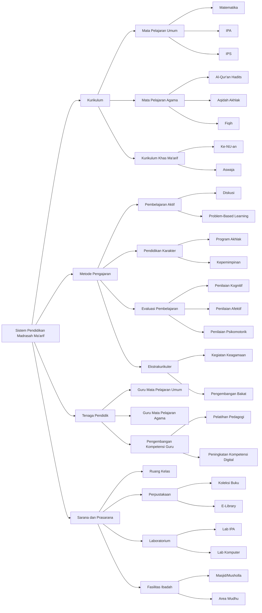

# Potensi Implementasi AI & Knowledge Graph untuk Peningkatan Sistem Belajar Mengajar di Madrasah Ma'arif

## Abstrak

Madrasah Ma'arif, sebagai lembaga pendidikan Islam yang mengintegrasikan ilmu agama dan umum, memainkan peran penting dalam pembentukan generasi Muslim yang komprehensif.

Di era digital ini, sistem pendidikan Madrasah Ma'arif menghadapi tantangan dalam hal modernisasi metode pengajaran, personalisasi pembelajaran, dan integrasi teknologi.

Paper ini mengeksplorasi potensi implementasi teknologi Artificial Intelligence (AI) dan Knowledge Graph dalam meningkatkan efektivitas dan kualitas sistem belajar mengajar di Madrasah Ma'arif.

Melalui analisis komprehensif, penelitian ini mengidentifikasi tiga area utama implementasi: sistem pembelajaran adaptif berbasis AI, pengembangan Knowledge Graph untuk integrasi kurikulum, dan platform kolaboratif berbasis AI untuk guru dan siswa.

Dalam sistem pembelajaran adaptif, AI yang diusulkan mengintegrasikan teknik machine learning untuk menganalisis gaya belajar siswa, tingkat pemahaman, dan memberikan rekomendasi materi yang personalized.

Untuk pengembangan Knowledge Graph, pendekatan yang diajukan memungkinkan integrasi berbagai mata pelajaran agama dan umum ke dalam jaringan pengetahuan yang terstruktur, memfasilitasi pemahaman holistik tentang hubungan antar konsep.

Platform kolaboratif yang diusulkan memfasilitasi interaksi guru-siswa melalui sistem manajemen kelas digital, peer learning, dan AI teaching assistant yang memahami nuansa pendidikan Islam.

Metodologi yang diajukan menggabungkan kecanggihan teknologi modern dengan kekayaan tradisi pendidikan Islam, menciptakan framework holistik yang mengatasi masalah kesenjangan digital, variasi kemampuan siswa, dan kebutuhan integrasi ilmu.

Paper ini juga membahas tantangan potensial dalam implementasi, termasuk kebutuhan untuk pelatihan guru, standardisasi kurikulum digital, dan pertimbangan etis terkait penggunaan AI dalam pendidikan Islam.

Roadmap implementasi bertahap diusulkan, dimulai dengan pengembangan infrastruktur hingga scaling ke jaringan Madrasah Ma'arif nasional.

Kesimpulannya, integrasi AI dan Knowledge Graph dalam sistem belajar mengajar Madrasah Ma'arif membuka peluang baru untuk peningkatan kualitas pendidikan Islam yang lebih relevan dan efektif, sambil tetap mempertahankan nilai-nilai dan tujuan pendidikan Islam.

## Keywords

Madrasah Ma'arif, artificial intelligence, knowledge graph, Islamic education, adaptive learning, educational technology, data visualization, collaborative learning platforms, curriculum integration, personalized learning

## 1. Diagram Dasar Sistem Pendidikan Madrasah Ma'arif

## 2. Penjelasan Ringkas Sistem Pendidikan Madrasah Ma'arif

### 2.1. PENDAHULUAN

#### 2.1.1. **Definisi Madrasah Ma'arif**

1. Lembaga pendidikan Islam di bawah naungan Lembaga Pendidikan Ma'arif Nahdlatul Ulama

2. Integrasi kurikulum nasional dan pendidikan Islam

#### 2.1.2. **Signifikansi Madrasah Ma'arif**

1. Pembentukan karakter Islami dan nasionalisme

2. Pengembangan SDM Muslim yang komprehensif

### 2.2. KOMPONEN UTAMA SISTEM PENDIDIKAN MADRASAH MA'ARIF

#### 2.2.1. **Kurikulum**

1. Integrasi mata pelajaran umum dan agama

2. Pengembangan kurikulum khas Ma'arif

#### 2.2.2. **Metode Pengajaran**

1. Pendekatan tradisional dan modern

2. Integrasi nilai-nilai Ahlussunnah wal Jamaah an Nahdliyyah

#### 2.2.3. **Tenaga Pendidik**

1. Kualifikasi guru mata pelajaran umum dan agama

2. Pengembangan kompetensi guru Ma'arif

#### 2.2.4. **Sarana dan Prasarana**

1. Fasilitas pembelajaran terintegrasi

2. Pengembangan perpustakaan dan laboratorium

### 2.3. METODOLOGI PEMBELAJARAN MADRASAH MA'ARIF

#### 2.3.1. **Pembelajaran Aktif**

1. Metode diskusi dan problem-solving

2. Integrasi teknologi dalam pembelajaran

#### 2.3.2. **Pendidikan Karakter**

1. Implementasi nilai-nilai Islam Ahlussunnah wal Jamaah an Nahdliyyah

2. Program pengembangan akhlak dan kepemimpinan

#### 2.3.3. **Evaluasi Pembelajaran**

1. Sistem penilaian komprehensif

2. Integrasi aspek kognitif, afektif, dan psikomotorik

#### 2.3.4. **Ekstrakurikuler**

1. Kegiatan pengembangan bakat dan minat

2. Program penguatan keagamaan dan sosial

### 2.4. TANTANGAN DALAM SISTEM PENDIDIKAN MADRASAH MA'ARIF

#### 2.4.1. **Modernisasi Metode Pengajaran**

1. Adaptasi terhadap perkembangan teknologi pendidikan

2. Peningkatan kompetensi digital guru

#### 2.4.2. **Integrasi Kurikulum**

1. Harmonisasi mata pelajaran umum dan agama

2. Pengembangan materi ajar yang kontekstual

#### 2.4.3. **Peningkatan Kualitas SDM**

1. Peningkatan kualifikasi dan kompetensi guru

2. Pengembangan sistem manajemen madrasah yang efektif

#### 2.4.4. **Infrastruktur dan Teknologi**

1. Pemerataan akses teknologi di seluruh madrasah

2. Pengembangan sistem informasi manajemen madrasah

### 2.5. ISU-ISU KONTEMPORER DALAM PENDIDIKAN MADRASAH MA'ARIF

#### 2.5.1. **Digitalisasi Pendidikan**

1. Implementasi e-learning dan blended learning

2. Pengembangan konten digital pendidikan Islam

#### 2.5.2. **Personalisasi Pembelajaran**

1. Adaptasi kurikulum terhadap kebutuhan individual siswa

2. Implementasi sistem pembelajaran adaptif

#### 2.5.3. **Integrasi STEM dan Pendidikan Islam**

1. Pengembangan kurikulum STEM berbasis nilai Islam

2. Kolaborasi dengan institusi sains dan teknologi

#### 2.5.4. **Pendidikan Multikultural**

1. Penguatan nilai-nilai toleransi dan keberagaman

2. Pengembangan program pertukaran siswa antar madrasah

## 3. Potensi Implementasi AI & Knowledge Graph

### 3.1. MASALAH UTAMA DALAM SISTEM PENDIDIKAN MADRASAH MA'ARIF

#### 3.1.1. **Kesenjangan Digital**

1. Variasi akses teknologi antar madrasah

2. Keterbatasan kompetensi digital guru dan siswa

3. Kurangnya konten digital pendidikan Islam yang berkualitas

#### 3.1.2. **Integrasi Kurikulum**

1. Kesulitan dalam mengharmoniskan mata pelajaran umum dan agama

2. Keterbatasan dalam kontekstualisasi materi agama dengan isu kontemporer

3. Kurangnya visualisasi hubungan antar konsep lintas mata pelajaran

#### 3.1.3. **Personalisasi Pembelajaran**

1. Kesulitan dalam mengakomodasi keragaman gaya belajar siswa

2. Keterbatasan dalam memberikan feedback individual yang cepat dan akurat

3. Kurangnya sistem adaptif untuk penyesuaian tingkat kesulitan materi

#### 3.1.4. **Efektivitas Pengajaran**

1. Keterbatasan dalam monitoring progress belajar siswa secara real-time

2. Kesulitan dalam mengoptimalkan alokasi waktu dan sumber daya pengajaran

3. Kurangnya tools untuk kolaborasi efektif antar guru dan siswa

### 3.2. SOLUSI POTENSIAL DENGAN TEKNOLOGI MODERN

#### 3.2.1. **AI untuk Sistem Pembelajaran Adaptif**

1. Implementasi

   1. Machine learning untuk analisis gaya belajar dan tingkat pemahaman siswa

   2. AI untuk rekomendasi materi dan aktivitas pembelajaran personalized

   3. Natural Language Processing untuk penilaian otomatis dan feedback

2. Contoh

   1. Sistem AI menganalisis pola belajar siswa dan menyesuaikan presentasi materi

   2. AI memberikan rekomendasi remedial atau pengayaan berdasarkan performa

   3. Chatbot edukatif yang menjawab pertanyaan siswa dengan konteks Islam

#### 3.2.2. **Knowledge Graph untuk Integrasi Kurikulum**

1. Implementasi

   1. Membangun graph komprehensif yang menghubungkan konsep lintas mata pelajaran

   2. Visualisasi interaktif hubungan antara ilmu umum dan agama

   3. Sistem rekomendasi materi lintas disiplin berbasis graph

2. Contoh

   1. Graph menunjukkan: `(Konsep Evolusi)-[PERSPEKTIF_ISLAM]-> (Tafsir Ayat Penciptaan)`

   2. Visualisasi jaringan konsep dari matematika ke ekonomi syariah

   3. Rekomendasi otomatis materi fisika yang relevan saat belajar tentang ibadah

#### 3.2.3. **Platform Kolaboratif Berbasis AI untuk Guru dan Siswa**

1. Implementasi

   1. Sistem manajemen kelas digital dengan analitik pembelajaran

   2. AI sebagai asisten pengajaran untuk guru

   3. Platform peer learning dengan matching berbasis AI

2. Fitur

   1. Dashboard analitik real-time untuk guru tentang performa kelas

   2. AI menyarankan strategi pengajaran berdasarkan data kelas

   3. Sistem yang menghubungkan siswa untuk belajar bersama berdasarkan kecocokan gaya belajar

### 3.3. ROADMAP IMPLEMENTASI

#### 3.3.1. **Fase 1: Pengembangan Infrastruktur**

1. Digitalisasi Konten

   1. Konversi buku teks dan materi ajar ke format digital interaktif

   2. Pengembangan konten multimedia pendidikan Islam

   3. Pembangunan database soal dan assessmen digital

2. Pengembangan Knowledge Graph

   1. Modeling relasi antar konsep dalam kurikulum Ma'arif

   2. Integrasi data kurikulum nasional dan pendidikan Islam

   3. Validasi graph oleh tim ahli pendidikan dan ulama

#### 3.3.2. **Fase 2: Pengembangan AI dan Tools**

1. Training Model AI

   1. Pengembangan model machine learning untuk analisis gaya belajar

   2. Training model untuk penilaian otomatis dan rekomendasi pembelajaran

   3. Integrasi dengan knowledge graph kurikulum

2. Pengembangan Interface

   1. Platform pembelajaran adaptif user-friendly untuk siswa

   2. Dashboard analitik dan manajemen kelas untuk guru

   3. Sistem administrasi madrasah terintegrasi

#### 3.3.3. **Fase 3: Implementasi dan Evaluasi**

1. Pilot Project

   1. Uji coba di beberapa Madrasah Ma'arif terpilih

   2. Evaluasi dampak terhadap hasil belajar dan engagement siswa

   3. Penyempurnaan berdasarkan feedback guru dan siswa

2. Scaling dan Diseminasi

   1. Perluasan implementasi ke jaringan Madrasah Ma'arif nasional

   2. Pelatihan guru dan administrator madrasah secara masif

   3. Pengembangan berkelanjutan dan update konten

### 3.4. TANTANGAN DAN MITIGASI

#### 3.4.1. **Tantangan Teknis**

1. Infrastruktur IT di Madrasah Pedesaan

   1. Mitigasi: Kerjasama dengan pemerintah dan CSR untuk penyediaan infrastruktur

   2. Pengembangan solusi offline yang dapat disinkronisasi

2. Keamanan Data dan Privasi Siswa

   1. Mitigasi: Implementasi standar keamanan data tingkat tinggi

   2. Pengembangan kebijakan privasi yang ketat dan transparan

#### 3.4.2. **Tantangan Non-Teknis**

1. Resistensi Terhadap Perubahan

   1. Mitigasi: Program sosialisasi dan edukasi bertahap untuk stakeholders

   2. Pelibatan ulama dan tokoh pendidikan dalam proses pengembangan

2. Keseimbangan Teknologi dan Nilai-nilai Tradisional

   1. Mitigasi: Integrasi nilai-nilai Islam dalam setiap aspek teknologi

   2. Pengembangan guideline penggunaan teknologi yang sesuai syariah
